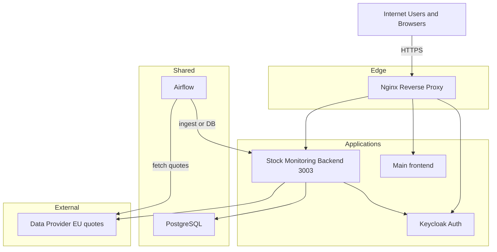
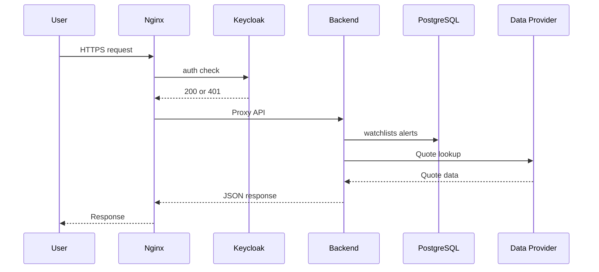

# Stock Monitoring Service – Architecture Design

**Version:** 1.0  
**Date:** January 2026  
**Status:** Design agreed; implementation in progress (MVP).

---

## 1. Overview

This document describes the **architecture** of the Stock Exchange Monitoring and Analysis service, aligned with the existing Lianel DC patterns used by **Comp-AI** and **Energy** services: shared Keycloak, shared PostgreSQL, shared Airflow and Nginx; product-specific backend, frontend, schema, and DAGs.

### 1.1 Objectives

- Provide **EU markets MVP** first (quotes, watchlists, price alerts, basic dashboard); expand globally later.
- Reuse **shared infrastructure**: Keycloak (auth), PostgreSQL (same DB, dedicated schema), Airflow (scheduled ingestion and optional alert runner), Nginx (reverse proxy).
- Keep **product-specific** code and config in `stock-monitoring/` (backend, frontend, docs) and in clearly named shared assets (migrations `022_*`, DAGs `stock_monitoring_*`).
- Support **audit logging**, **latency**, and **security** as P0 non-functionals (see function list).

### 1.2 Scope

- **MVP:** EU markets (exchanges, symbols, data sources). See `EU-MARKETS-MVP.md`.
- **Out of scope for MVP:** North American exchanges, multi-asset, advanced analytics; add in later phases.

---

## 2. High-Level Architecture



**Request flow (simplified):**



---

## 3. Components

### 3.1 Stock Monitoring Backend (product-specific)

| Attribute | Value |
|-----------|--------|
| **Location** | `lianel/dc/stock-monitoring/backend/` |
| **Stack** | Rust, Axum, Tokio, Tower, Serde, tracing (aligned with Energy and Comp-AI) |
| **Port** | **3003** (profile 3000, energy 3001, comp-ai 3002) |
| **Container** | `lianel-stock-monitoring-service` |

**Responsibilities:**

- REST API: watchlists CRUD, alerts CRUD, quotes (from DB or real-time proxy), status/health.
- Authentication: validate JWT from Keycloak (shared realm); extract `user_id` (sub) for watchlists and alerts.
- Persistence: `stock_monitoring` schema in shared PostgreSQL (watchlists, watchlist_items, alerts, audit_log).
- Audit: write to `stock_monitoring.audit_log` for alert/watchlist changes and optionally quote access.
- (Optional) Ingestion API: endpoint for Airflow DAG to push ingested quotes; or DAG writes directly to DB.

**Endpoints (planned):**

- `GET /health` – health check (no auth).
- `GET /api/v1/status` – service name, version, scope (e.g. EU markets MVP).
- `GET /api/v1/watchlists`, `POST /api/v1/watchlists`, `GET /api/v1/watchlists/:id`, etc.
- `GET /api/v1/alerts`, `POST /api/v1/alerts`, `PUT /api/v1/alerts/:id`, etc.
- `GET /api/v1/quotes?symbols=...` – delayed/near-real-time quotes (EU symbols).
- OpenAPI/Swagger when implemented (follow Energy/Comp-AI pattern).

### 3.2 Stock Monitoring Frontend (product-specific)

| Attribute | Value |
|-----------|--------|
| **Location** | `lianel/dc/stock-monitoring/frontend/` |
| **Stack** | React (Create React App or equivalent) |
| **Serving** | Built static assets; served by Nginx (e.g. `/stock`) or same host as main frontend |

**Responsibilities:**

- Dashboard: watchlist prices, last update, simple trend (P0).
- Watchlist and alert management (CRUD).
- Auth: Keycloak (shared) – same as main frontend; reuse login/session or dedicated client.
- Calls **only** stock-monitoring backend at `/api/v1/stock-monitoring/*` (or chosen path).

### 3.3 PostgreSQL (shared)

| Attribute | Value |
|-----------|--------|
| **Database** | Same as other services (e.g. `lianel_energy` or platform DB). |
| **Schema** | `stock_monitoring` (isolated from `comp_ai`, public energy tables, etc.). |
| **Migrations** | `lianel/dc/database/migrations/022_stock_monitoring_schema.sql` (and future `023_*`). |

**Tables (MVP):**

- `stock_monitoring.watchlists`, `stock_monitoring.watchlist_items`
- `stock_monitoring.alerts`
- `stock_monitoring.audit_log`
- (Optional) `stock_monitoring.quotes` or `stock_monitoring.quote_cache` for ingested EU quotes.

### 3.4 Airflow (shared)

| Attribute | Value |
|-----------|--------|
| **DAGs** | `lianel/dc/dags/stock_monitoring_ingest_dag.py` (and future alert-evaluation DAG if needed). |
| **Role** | **Runner** for scheduled jobs: ingest EU quotes (and optionally evaluate alerts). |
| **Pattern** | Same as Comp-AI: Airflow **pulls** – runs on schedule, calls backend API and/or writes to DB; no push from backend to Airflow in base design. |

**Variables (when implemented):**

- `STOCK_MONITORING_BASE_URL` – backend base URL (e.g. `http://lianel-stock-monitoring-service:3003`).
- `STOCK_MONITORING_DATA_PROVIDER_API_KEY` – API key for EU data provider (Alpha Vantage, Polygon, etc.).
- Optional: Keycloak client credentials for backend auth if DAG calls protected endpoints.

### 3.5 Keycloak (shared)

| Attribute | Value |
|-----------|--------|
| **Realm** | Same as Comp-AI and frontend (e.g. `lianel`). |
| **Client (optional)** | Dedicated client `stock-monitoring` or reuse main frontend client; backend validates JWT from same realm. |

User identity (`sub`) is used for watchlists and alerts isolation and for audit log.

### 3.6 Nginx (shared)

| Attribute | Value |
|-----------|--------|
| **Config** | `lianel/dc/nginx/config/nginx.conf` |
| **API path** | `/api/v1/stock-monitoring/` → proxy to `lianel-stock-monitoring-service:3003` (rewrite rule to strip prefix if backend expects `/api/v1/...`). |
| **Health** | Public `GET /api/v1/stock-monitoring/health` → backend `/health`. |
| **Auth** | Protected routes: `auth_request` + `error_page 401` (same pattern as Comp-AI); backend also validates JWT. |

Optional: location for stock-monitoring frontend (e.g. `/stock`) or dedicated subdomain.

---

## 4. Integration Points

| Integration | Direction | Description |
|-------------|-----------|-------------|
| **Keycloak** | Backend ↔ Keycloak | Validate JWT; optional client credentials for Airflow→backend. |
| **PostgreSQL** | Backend ↔ DB | Read/write `stock_monitoring.*`; same host/user as other services. |
| **Airflow → Backend or DB** | Airflow → Backend / DB | Ingest DAG: fetch EU quotes from provider, write to DB or POST to backend ingest API. |
| **External data provider** | Airflow or Backend → Provider | REST API for EU symbols (Alpha Vantage, Polygon, IEX, FMP, etc.); credentials in env/Airflow Variables. |
| **Frontend → Backend** | Browser → Nginx → Backend | All API calls via `/api/v1/stock-monitoring/*`. |

---

## 5. Deployment

### 5.1 Docker Compose

Follow Comp-AI pattern: **separate compose file** for the product stack.

- **File:** `lianel/dc/docker-compose.stock-monitoring.yaml` (to be added).
- **Service:** `stock-monitoring-service` (or `stock-monitoring-backend`).
- **Image:** Build from `./stock-monitoring/backend` or use registry image.
- **Port:** Expose **3003** internally; no host publish required (Nginx proxies).
- **Env:** `PORT=3003`, `POSTGRES_*`, `KEYCLOAK_*`, optional `STOCK_MONITORING_*` (data provider URL, etc.).
- **Network:** `lianel-network` (external).
- **Depends_on:** Keycloak (for auth); DB typically host or separate stack.
- **Healthcheck:** `GET http://localhost:3003/health`.

### 5.2 Nginx Snippet (to add)

```nginx
# Stock Monitoring Backend – health (public)
location = /api/v1/stock-monitoring/health {
    if ($scheme != "https") { return 301 https://$host$request_uri; }
    proxy_pass http://lianel-stock-monitoring-service:3003/health;
    proxy_http_version 1.1;
    proxy_set_header Host $host;
    proxy_set_header X-Real-IP $remote_addr;
    proxy_set_header X-Forwarded-Proto $scheme;
}

# Stock Monitoring API (authenticated)
location /api/v1/stock-monitoring/ {
    if ($scheme != "https") { return 301 https://$host$request_uri; }
    auth_request /oauth2/auth;
    error_page 401 = /oauth2/sign_in;
    limit_req zone=general burst=20 nodelay;
    # Rewrite: /api/v1/stock-monitoring/status -> /api/v1/status
    rewrite ^/api/v1/stock-monitoring/health$ /health break;
    rewrite ^/api/v1/stock-monitoring(/.*)$ /api/v1$1 break;
    proxy_pass http://lianel-stock-monitoring-service:3003;
    proxy_http_version 1.1;
    proxy_set_header Host $host;
    proxy_set_header X-Real-IP $remote_addr;
    proxy_set_header X-Forwarded-For $proxy_add_x_forwarded_for;
    proxy_set_header X-Forwarded-Proto $scheme;
    proxy_connect_timeout 30s;
    proxy_send_timeout 60s;
    proxy_read_timeout 60s;
}
```

Backend must serve routes under `/api/v1/...` so that after rewrite the paths match.

### 5.3 Keycloak

- Reuse existing realm.
- Optional: create client `stock-monitoring` (confidential) for backend service account; redirect URIs for frontend if separate.
- Frontend can use same client as main app (e.g. `www.lianel.se` redirect URI) and pass Bearer token to stock-monitoring API.

### 5.4 Database

- Run migrations in order: `022_stock_monitoring_schema.sql` (and any new `023_*`).
- Same DB user as Airflow/Comp-AI; grant usage on schema `stock_monitoring` to that user.

---

## 6. Security and Non-Functional

- **Auth:** All mutable and user-specific endpoints require valid Keycloak JWT; health and optional status may be public.
- **Audit:** All material actions (create/update/delete watchlist/alert, trigger notification) written to `stock_monitoring.audit_log` with user_id, action, resource, timestamp.
- **Secrets:** Data provider API keys and Keycloak client secret in env or Airflow Variables/secret backend; never in repo.
- **Latency:** Quote and alert delivery within provider and channel limits (P0); minimize round-trips in dashboard.
- **Rate limiting:** Nginx `limit_req` on API location; optional per-user rate limit in backend (like Comp-AI).

---

## 7. References

- **Function list and priorities:** `lianel/dc/docs/status/STOCK-EXCHANGE-MONITORING-SERVICE-FUNCTION-LIST.md`
- **EU MVP scope:** `lianel/dc/stock-monitoring/docs/EU-MARKETS-MVP.md`
- **Comp-AI deployment pattern:** `lianel/dc/docs/deployment/COMP-AI-DEPLOYMENT-PLAN.md`
- **Comp-AI Airflow as runner:** `lianel/dc/docs/status/COMP-AI-AIRFLOW-RUNNER-DESIGN.md`
- **Migrations:** `lianel/dc/database/migrations/022_stock_monitoring_schema.sql`
- **DAG placeholder:** `lianel/dc/dags/stock_monitoring_ingest_dag.py`
- **Backend scaffold:** `lianel/dc/stock-monitoring/backend/`
- **Frontend scaffold:** `lianel/dc/stock-monitoring/frontend/`
- **Implementation plan:** [IMPLEMENTATION-PLAN.md](./IMPLEMENTATION-PLAN.md) (phases and steps)
- **Task checklist:** [TASK-CHECKLIST.md](./TASK-CHECKLIST.md) (checkbox list to follow)

---

**Document owner:** Product / engineering.  
**Next steps:** Follow [TASK-CHECKLIST.md](./TASK-CHECKLIST.md) from Phase 1 (migration, backend auth, compose, Nginx).

---

## 8. As built (MVP)

Summary of what is deployed and how to operate it.

### 8.1 Services and ports

| Component | Container / service | Port | Notes |
|-----------|----------------------|------|--------|
| Backend | `lianel-stock-monitoring-service` | 3003 | Rust/Axum; health at `/health`, API at `/api/v1/*` |
| Frontend | Served by Nginx | — | Static build at `/stock` (or configured path) |
| DB | Shared PostgreSQL | 5432 | Schema `stock_monitoring`; migrations 022, 023 |

### 8.2 Backend environment (as built)

| Variable | Required | Description |
|----------|----------|-------------|
| `PORT` | No | Default 3003 |
| `POSTGRES_HOST` | Yes* | DB host (*or use `DATABASE_URL`) |
| `POSTGRES_PORT` | Yes* | Default 5432 |
| `POSTGRES_USER` | Yes* | DB user |
| `POSTGRES_PASSWORD` | Yes* | DB password |
| `POSTGRES_DB` | Yes* | Database name |
| `KEYCLOAK_URL` | No | JWKS URL (default https://auth.lianel.se) |
| `KEYCLOAK_REALM` | No | Realm (default lianel) |
| `STOCK_MONITORING_QUOTE_PROVIDER` | No | e.g. yahoo, alpha_vantage |
| `STOCK_MONITORING_DATA_PROVIDER_API_KEY` | If provider needs it | API key for Alpha Vantage fallback |
| `STOCK_MONITORING_FINNHUB_API_KEY` or `FINNHUB_API_KEY` | No | When set, Finnhub.io is used as quote source (see [Finnhub Quote API](https://finnhub.io/docs/api/quote)) |
| `STOCK_MONITORING_QUOTE_CACHE_TTL_SECONDS` | No | In-memory quote cache TTL |

### 8.3 Runbooks (ops)

| Topic | Runbook |
|-------|---------|
| Run migrations 022/023 (local and prod) | [STOCK-MONITORING-MIGRATIONS.md](../../docs/runbooks/STOCK-MONITORING-MIGRATIONS.md) |
| Add symbols (watchlists, ingest when implemented) | [STOCK-MONITORING-SYMBOLS.md](../../docs/runbooks/STOCK-MONITORING-SYMBOLS.md) |
| Debug alert evaluation | [STOCK-MONITORING-ALERT-DEBUG.md](../../docs/runbooks/STOCK-MONITORING-ALERT-DEBUG.md) |

### 8.4 CI/CD

- **Workflow:** `.github/workflows/stock-monitoring-ci-deploy.yml`
- **CI:** On push/PR to backend or migrations: Postgres service, migrations 022/023, `cargo test` (unit + integration), `cargo build --release`, then image build/push.
- **CD:** On push to `master`/`main`: deploy to remote host, run migrations on prod DB, restart service, health check.
