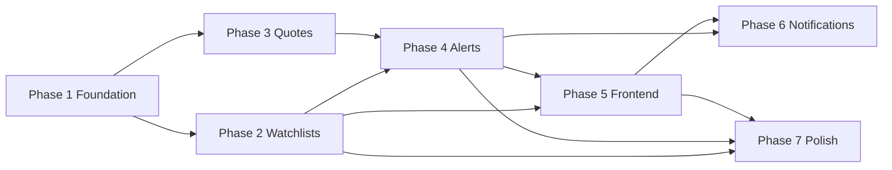

# Stock Monitoring Service – Implementation Plan

**Version:** 1.0  
**Date:** January 2026  
**Scope:** EU markets MVP (P0).  
**References:** [Function list](../../docs/status/STOCK-EXCHANGE-MONITORING-SERVICE-FUNCTION-LIST.md), [Architecture design](./ARCHITECTURE-DESIGN.md), [EU MVP](./EU-MARKETS-MVP.md).

---

## 1. Overview

This plan breaks implementation into **phases** and **steps**. Each step is concrete and ordered so dependencies are respected. Complete phases in order; within a phase, steps can sometimes be parallelised (noted where relevant).

### 1.1 Phase summary

| Phase | Focus | Main deliverables |
|-------|--------|-------------------|
| **1** | Foundation | Infra (compose, nginx, Keycloak), DB migration applied, backend running with auth |
| **2** | Watchlists + audit | Watchlist CRUD API, audit logging middleware, P0.2 + P0.7 |
| **3** | Quotes & data | Quote storage (optional table), ingest DAG, quotes API, P0.1 |
| **4** | Alerts | Alert CRUD, condition types, evaluation (price above/below), P0.3 |
| **5** | Frontend | Dashboard, watchlist/alert UI, Keycloak login, P0.5 + P0.6 |
| **6** | Notifications | One channel (email or in-app), P0.4 |
| **7** | Polish | OpenAPI, tests, runbooks, optional alert hub |

### 1.2 Dependency overview

---

## 2. Phase 1 – Foundation

**Goal:** Backend is deployable, reachable via Nginx, and can authenticate users. Database schema exists.

### 2.1 Step 1.1 – Apply database migration

| Item | Detail |
|------|--------|
| **What** | Run migration `022_stock_monitoring_schema.sql` on the shared PostgreSQL instance. |
| **Where** | `lianel/dc/database/migrations/022_stock_monitoring_schema.sql` (already exists). |
| **How** | Use existing migration process (e.g. `psql`, Flyway, or project script). Ensure DB user used by backend has `USAGE` on schema `stock_monitoring` and `SELECT/INSERT/UPDATE/DELETE` on its tables. |
| **Done when** | Schema `stock_monitoring` exists; tables `watchlists`, `watchlist_items`, `alerts`, `audit_log` are present; indexes exist. |

### 2.2 Step 1.2 – Backend: add config and database pool

| Item | Detail |
|------|--------|
| **What** | Add configuration (env) and PostgreSQL connection pool (e.g. `sqlx`) to the stock-monitoring backend. |
| **Where** | `stock-monitoring/backend/src/` – new or extended `config.rs`, `db/mod.rs` (or equivalent). |
| **How** | Read `POSTGRES_HOST`, `POSTGRES_PORT`, `POSTGRES_USER`, `POSTGRES_PASSWORD`, `POSTGRES_DB`; build `DATABASE_URL` if needed; create `PgPool` and pass into app state. Follow pattern from `comp-ai-service` or `energy-service`. |
| **Done when** | Backend starts without error; pool is in app state; no routes use it yet (optional: add a trivial DB check in `/health` or `/api/v1/status`). |

### 2.3 Step 1.3 – Backend: add Keycloak JWT validation

| Item | Detail |
|------|--------|
| **What** | Validate Bearer JWT using Keycloak (shared realm). Extract `sub` as `user_id` for use in handlers. |
| **Where** | `stock-monitoring/backend/src/auth/` – e.g. `keycloak.rs`, `mod.rs`. |
| **How** | Use Keycloak JWKS endpoint or a Rust JWT library (e.g. `jsonwebtoken`) with issuer and audience checks. Implement a Tower layer or middleware that returns 401 when token is missing/invalid and injects `user_id` into request extensions. Reuse pattern from Comp-AI or Energy. |
| **Done when** | Unprotected routes (`/health`, optionally `/api/v1/status`) work without token; protected routes return 401 without valid Bearer token and 200 (or business logic response) with valid token. |

### 2.4 Step 1.4 – Backend: wire protected and public routes

| Item | Detail |
|------|--------|
| **What** | Organise router so `/health` and optionally `/api/v1/status` are public; all other `/api/v1/*` routes go through auth layer. |
| **Where** | `stock-monitoring/backend/src/main.rs` (and possibly `handlers/mod.rs`). |
| **How** | Two route groups: one without auth, one with auth middleware. Mount under same app. |
| **Done when** | `GET /health` and `GET /api/v1/status` work without auth; any other `/api/v1/*` returns 401 without token. |

### 2.5 Step 1.5 – Docker Compose for stock-monitoring

| Item | Detail |
|------|--------|
| **What** | Add a compose file that builds and runs the stock-monitoring backend. |
| **Where** | `lianel/dc/docker-compose.stock-monitoring.yaml` (new). |
| **How** | One service: build from `./stock-monitoring/backend`, image/container name as in architecture (e.g. `lianel-stock-monitoring-service`). Set `PORT=3003`, `POSTGRES_*`, `KEYCLOAK_URL`, `KEYCLOAK_REALM`. Use network `lianel-network` (external). Healthcheck: `GET http://localhost:3003/health`. No Keycloak client secret required for JWT validation only (public JWKS). |
| **Done when** | `docker compose -f docker-compose.stock-monitoring.yaml up --build` starts the service; health returns 200. |

### 2.6 Step 1.6 – Nginx configuration for stock-monitoring API

| Item | Detail |
|------|--------|
| **What** | Add Nginx location blocks so `/api/v1/stock-monitoring/` is proxied to the backend. |
| **Where** | `lianel/dc/nginx/config/nginx.conf`. |
| **How** | Public `location = /api/v1/stock-monitoring/health` → proxy to backend `/health`. Protected `location /api/v1/stock-monitoring/` with auth_request (same pattern as Comp-AI); rewrite to strip `/api/v1/stock-monitoring` so backend receives `/api/v1/...`; proxy to backend. |
| **Done when** | From a client that can reach Nginx: `GET https://<host>/api/v1/stock-monitoring/health` returns 200; protected path returns 401 without login and forwards to backend with valid session. |

### 2.7 Step 1.7 – Keycloak (optional client)

| Item | Detail |
|------|--------|
| **What** | Decide whether to create a dedicated Keycloak client for stock-monitoring frontend or reuse existing (e.g. main frontend client). |
| **Where** | Keycloak admin UI or script under `scripts/keycloak-setup/`. |
| **How** | If new client: create confidential client, set redirect URIs for the stock UI (e.g. `https://www.lianel.se/stock/*`). Backend only needs to validate JWTs (same realm); no backend client required for MVP if frontend sends Bearer token. |
| **Done when** | Users can log in and obtain a JWT that the backend accepts (same realm/issuer). |

**Phase 1 exit criteria:** Backend runs in Docker, Nginx proxies to it, DB schema is applied, and at least one protected route validates Keycloak JWT and returns 401/200 as expected.

---

## 3. Phase 2 – Watchlists and audit (P0.2, P0.7)

**Goal:** Full watchlist CRUD over API; every mutation is recorded in `audit_log`.

### 3.1 Step 2.1 – Backend: watchlist and watchlist_items models and DB access

| Item | Detail |
|------|--------|
| **What** | Define structs for watchlist and watchlist_item; implement DB queries (list by user, get by id, create, update, delete). |
| **Where** | `stock-monitoring/backend/src/models/`, `stock-monitoring/backend/src/db/` (or equivalent). |
| **How** | Use sqlx (compile-time or runtime) for `stock_monitoring.watchlists` and `stock_monitoring.watchlist_items`. Enforce `user_id` from JWT on all operations. |
| **Done when** | Can list, get, create, update, delete watchlists and items in code (e.g. from a test or manual call). |

### 3.2 Step 2.2 – Backend: watchlist REST API

| Item | Detail |
|------|--------|
| **What** | Expose REST endpoints for watchlists and items. |
| **Where** | `stock-monitoring/backend/src/handlers/` (e.g. `watchlists.rs`). |
| **How** | `GET /api/v1/watchlists` (list), `POST /api/v1/watchlists` (create), `GET /api/v1/watchlists/:id` (get), `PUT /api/v1/watchlists/:id` (update), `DELETE /api/v1/watchlists/:id`. For items: `GET /api/v1/watchlists/:id/items`, `POST /api/v1/watchlists/:id/items`, `DELETE /api/v1/watchlists/:id/items/:symbol`. All require auth; use `user_id` from JWT. Return 403 if watchlist does not belong to user. |
| **Done when** | Each endpoint works with a valid JWT; list/create/get/update/delete are consistent with DB. |

### 3.3 Step 2.3 – Backend: audit logging helper and middleware

| Item | Detail |
|------|--------|
| **What** | Central helper to write to `stock_monitoring.audit_log` (action, resource_type, resource_id, user_id, details JSON, created_at). Optionally a middleware or per-handler calls after success. |
| **Where** | `stock-monitoring/backend/src/db/` or `src/audit.rs`. |
| **How** | Function `log_audit(pool, user_id, action, resource_type, resource_id, details)`. Call it after each watchlist/watchlist_item create/update/delete. |
| **Done when** | Every watchlist and item mutation results in a row in `audit_log` with correct action and resource references. |

### 3.4 Step 2.4 – Backend: validate symbol format (EU)

| Item | Detail |
|------|--------|
| **What** | Basic validation for symbol (and optional MIC) when adding to watchlist: format, length, allowlist of MICs or symbols for EU MVP if desired. |
| **Where** | In watchlist item create handler or shared validator. |
| **How** | Reject invalid length or characters; optionally check against a fixed list of EU MICs (e.g. XETR, XPAR, XLON). Document in EU-MARKETS-MVP.md. |
| **Done when** | Invalid symbols are rejected with 400; valid EU symbols are accepted. |

**Phase 2 exit criteria:** Watchlist CRUD is fully functional via API; all mutations are audited; symbols are validated for EU MVP.

---

## 4. Phase 3 – Quotes and data (P0.1)

**Goal:** Backend can return quotes for given symbols (EU). Data comes from ingested store and/or live provider.

### 4.1 Step 3.1 – Decide quote storage strategy

| Item | Detail |
|------|--------|
| **What** | Choose one: (A) Airflow DAG writes quotes to a table; backend reads from it. (B) Backend calls external provider on demand (with caching). (C) Hybrid: ingest into DB, backend reads DB and optionally refreshes from provider. |
| **Where** | Design doc or this plan. |
| **How** | **Default for MVP:** (A) – one migration for quote cache table (Step 3.2), DAG populates it, backend serves from DB. Simplest and aligns with existing ingest DAG placeholder. If you prefer (B) or (C), document the choice and skip or adapt Step 3.2 as needed. |
| **Done when** | Decision documented; if DB storage chosen, migration added (Step 3.2). |

### 4.2 Step 3.2 – Migration: quote cache table (if applicable)

| Item | Detail |
|------|--------|
| **What** | Add table(s) for storing latest (or time-series) quotes per symbol, e.g. `stock_monitoring.quote_cache` (symbol, price, currency, updated_at, source). |
| **Where** | `lianel/dc/database/migrations/023_stock_monitoring_quote_cache.sql` (new). |
| **How** | CREATE TABLE with indexes on symbol and updated_at. Keep scope EU (symbol/MIC as needed). |
| **Done when** | Migration runs cleanly; backend can read from it once Step 3.4 is done. |

### 4.3 Step 3.3 – Airflow: implement EU quote ingest DAG

| Item | Detail |
|------|--------|
| **What** | Replace placeholder DAG with real logic: fetch quotes for a configured list of EU symbols from chosen provider (Alpha Vantage, Polygon, FMP, etc.), write to DB (or call backend ingest API). |
| **Where** | `lianel/dc/dags/stock_monitoring_ingest_dag.py`, optionally `dags/utils/stock_monitoring_client.py`. |
| **How** | Use Airflow Variables for provider API key and symbol list. Implement task: call provider API, parse response, insert/upsert into `stock_monitoring.quote_cache` (or POST to backend). Schedule (e.g. every 15 min during EU session). |
| **Done when** | DAG runs without error; quote table (or backend) is updated with latest prices for configured symbols. |

### 4.4 Step 3.4 – Backend: quotes API

| Item | Detail |
|------|--------|
| **What** | `GET /api/v1/quotes?symbols=AAPL,MSFT` (or comma-separated). Returns latest price (and optional previous close, change %) for each symbol. |
| **Where** | `stock-monitoring/backend/src/handlers/quotes.rs` (or equivalent). |
| **How** | Read from quote cache table (and optionally previous close if stored). Filter by allowed EU symbols/MICs. Optional: short TTL cache in memory. Require auth for P0. |
| **Done when** | Frontend or client can request quotes for symbols that exist in cache; response includes price and last update time. |

### 4.5 Step 3.5 – Dashboard “last update” and data freshness

| Item | Detail |
|------|--------|
| **What** | Backend exposes last ingestion time (e.g. from latest row in quote_cache or a small status table). Optional: `GET /api/v1/quotes/status` or include in existing status. |
| **Where** | Backend handler or status endpoint. |
| **Done when** | Client can show “Data as of &lt;time&gt;” for dashboard (P0.5). |

**Phase 3 exit criteria:** Quotes are ingested on a schedule; backend returns quotes for requested EU symbols; dashboard can show last update time.

---

## 5. Phase 4 – Alerts (P0.3)

**Goal:** Users can create and manage price-based alerts; backend can evaluate them and record triggers.

### 5.1 Step 4.1 – Backend: alert model and DB layer

| Item | Detail |
|------|--------|
| **What** | Use existing `stock_monitoring.alerts` table; implement queries: list by user, get by id, create, update, delete, list by symbol (for evaluation). |
| **Where** | `stock-monitoring/backend/src/models/`, `stock-monitoring/backend/src/db/`. |
| **How** | Map `condition_type` to price_above, price_below, pct_change_up, pct_change_down (or similar). Store `condition_value`. Enforce user_id on all access. |
| **Done when** | CRUD for alerts works in code. |

### 5.2 Step 4.2 – Backend: alerts REST API

| Item | Detail |
|------|--------|
| **What** | `GET /api/v1/alerts`, `POST /api/v1/alerts`, `GET /api/v1/alerts/:id`, `PUT /api/v1/alerts/:id`, `DELETE /api/v1/alerts/:id`. Support enable/disable (e.g. PATCH or PUT with `enabled`). |
| **Where** | `stock-monitoring/backend/src/handlers/alerts.rs`. |
| **How** | All scoped by JWT `user_id`. Audit log on create/update/delete. Validate symbol and condition_type/condition_value. |
| **Done when** | Full alert CRUD via API; audit entries for alert changes. |

### 5.3 Step 4.3 – Backend: alert evaluation (price conditions)

| Item | Detail |
|------|--------|
| **What** | Function (or job) that: loads enabled alerts, loads latest quotes for affected symbols, for each alert checks condition (e.g. price >= threshold or <= threshold), and if triggered: set `notified_at`, write audit log, and enqueue or send notification (Phase 6). |
| **Where** | `stock-monitoring/backend/src/` (e.g. `alert_engine.rs` or handler called by DAG). |
| **How** | Run periodically (Airflow task or backend cron) or on demand. Idempotent: only trigger if not already notified for current “event” (e.g. same day or same price bar). |
| **Done when** | When quotes are updated, running evaluation correctly marks triggered alerts and writes to audit_log. |

### 5.4 Step 4.4 – Airflow: optional alert evaluation DAG

| Item | Detail |
|------|--------|
| **What** | DAG that runs after quote ingest: calls backend endpoint to run alert evaluation (or backend runs it internally after ingest). |
| **Where** | `lianel/dc/dags/stock_monitoring_alerts_dag.py` (new). |
| **How** | Single task: HTTP POST to backend `/api/v1/alerts/evaluate` (or internal only). Schedule after ingest DAG. |
| **Done when** | Alerts are evaluated automatically after each quote update. |

**Phase 4 exit criteria:** Alert CRUD works; price-based conditions are evaluated; triggered alerts are recorded and ready for notification (Phase 6).

---

## 6. Phase 5 – Frontend (P0.5, P0.6)

**Goal:** Basic dashboard with watchlist prices and last update; watchlist and alert management UI; login via Keycloak.

### 6.1 Step 5.1 – Frontend: auth and API client

| Item | Detail |
|------|--------|
| **What** | Integrate Keycloak (e.g. keycloak-js or react-oidc); obtain Bearer token; call stock-monitoring API with Authorization header. |
| **Where** | `stock-monitoring/frontend/src/` – auth context, API client (axios/fetch base URL `/api/v1/stock-monitoring`). |
| **How** | On load, check login; redirect to Keycloak if not authenticated. Store token; attach to all API requests. Handle 401 (refresh or re-login). |
| **Done when** | User can log in; API client sends valid token; protected API calls succeed. |

### 6.2 Step 5.2 – Frontend: dashboard page (basic)

| Item | Detail |
|------|--------|
| **What** | Single dashboard view: list of user’s watchlists with first N symbols; for each symbol show latest price, last update, and simple trend (up/down vs previous close if available). |
| **Where** | `stock-monitoring/frontend/src/` – e.g. `Dashboard.js`, `components/QuoteTable.js`. |
| **How** | Fetch watchlists, then fetch quotes for all symbols in those watchlists; display table/cards. Show “Data as of &lt;time&gt;”. |
| **Done when** | P0.5 satisfied: one screen with watchlist prices and last update. |

### 6.3 Step 5.3 – Frontend: watchlist management

| Item | Detail |
|------|--------|
| **What** | Pages or modals: create watchlist, rename, delete; add/remove symbols (with EU symbol validation feedback). |
| **Where** | `stock-monitoring/frontend/src/` – e.g. `Watchlists.js`, `WatchlistForm.js`, `WatchlistDetail.js`. |
| **How** | CRUD via backend API; list watchlists; drill into one to see items and add/remove symbols. |
| **Done when** | User can create and edit watchlists and symbols from the UI. |

### 6.4 Step 5.4 – Frontend: alert management

| Item | Detail |
|------|--------|
| **What** | Create alert (symbol, condition type, value); list alerts; edit/delete; enable/disable. |
| **Where** | `stock-monitoring/frontend/src/` – e.g. `Alerts.js`, `AlertForm.js`. |
| **How** | Forms for condition type (e.g. price above/below) and value; call alerts API. List with status (enabled/triggered). |
| **Done when** | User can create and manage price alerts from the UI. |

### 6.5 Step 5.5 – Frontend: routing and layout

| Item | Detail |
|------|--------|
| **What** | Routes for dashboard, watchlists, alerts; navigation; layout (header with user/logout). |
| **Where** | `stock-monitoring/frontend/src/App.js`, router, layout components. |
| **How** | React Router (or similar); menu or tabs for Dashboard, Watchlists, Alerts; logout clears session and redirects to Keycloak. |
| **Done when** | All main screens are reachable; layout is consistent. |

### 6.6 Step 5.6 – Serve frontend via Nginx

| Item | Detail |
|------|--------|
| **What** | Build React app; serve static files under e.g. `/stock` or subdomain. |
| **Where** | Nginx config; build output (e.g. `frontend/build/`) deployed to path or static server. |
| **How** | Add location `/stock` that serves static files and fallback to index.html for SPA. Optionally protect with same auth as API. |
| **Done when** | User can open `https://<host>/stock` (or configured URL), log in, and use dashboard and management screens. |

**Phase 5 exit criteria:** Dashboard shows watchlist quotes and last update; watchlist and alert CRUD work in UI; auth is Keycloak-based end-to-end.

---

## 7. Phase 6 – Notifications (P0.4)

**Goal:** At least one channel to deliver alert notifications (email or in-app).

### 7.1 Step 6.1 – Choose and implement one channel

| Item | Detail |
|------|--------|
| **What** | Implement either (A) Email: when alert triggers, send email to user (from user profile or registration). (B) In-app: store “notification” rows and expose `GET /api/v1/notifications`; frontend shows badge and list. |
| **Where** | Backend: email client or notifications table + API; frontend (if in-app): notifications component. |
| **How** | (A) Use SMTP or SendGrid/etc.; get user email from Keycloak or from user profile in DB. (B) Add table `stock_monitoring.notifications` (user_id, alert_id, message, read_at, created_at); on trigger insert row and return in API. |
| **Done when** | When an alert triggers, user receives notification via chosen channel. |

### 7.2 Step 6.2 – Wire trigger to notification

| Item | Detail |
|------|--------|
| **What** | From alert evaluation (Phase 4), on trigger: call notification logic (send email or insert in-app row). |
| **Where** | Backend alert evaluation code. |
| **How** | After setting `notified_at` and writing audit_log, invoke email send or insert into notifications table. |
| **Done when** | End-to-end: quote update → evaluation → trigger → notification delivered. |

**Phase 6 exit criteria:** P0.4 satisfied; at least one notification channel works for triggered alerts.

---

## 8. Phase 7 – Polish

**Goal:** API docs, tests, and operational clarity.

### 8.1 Step 7.1 – OpenAPI and Swagger UI

| Item | Detail |
|------|--------|
| **What** | Document all REST endpoints with OpenAPI; serve Swagger UI at e.g. `/swagger-ui` or `/api-doc`. |
| **Where** | Backend: utoipa + utoipa-swagger-ui (like Comp-AI) or manual OpenAPI YAML. |
| **Done when** | Developers can discover and try all endpoints via Swagger. |

### 8.2 Step 7.2 – Backend unit and integration tests

| Item | Detail |
|------|--------|
| **What** | Unit tests for validation and business logic; integration tests for critical paths (watchlist CRUD, alert CRUD, quote fetch) with test DB or mocks. |
| **Where** | `stock-monitoring/backend/tests/` or inline `#[cfg(test)]`. |
| **Done when** | CI can run tests; main flows are covered. |

### 8.3 Step 7.3 – Runbooks and docs

| Item | Detail |
|------|--------|
| **What** | Short runbooks: how to run migrations, how to add symbols for ingest, how to debug alert evaluation. Update README and architecture/implementation plan with “as built” details. |
| **Where** | `stock-monitoring/docs/` or `lianel/dc/docs/runbooks/`. |
| **Done when** | New developer or ops can follow docs to operate the service. |

### 8.4 Step 7.4 – (Optional) Alert management hub (P1.7)

| Item | Detail |
|------|--------|
| **What** | Frontend: list all alerts with filter/search, show recent triggers, bulk enable/disable. May be partially done in Phase 5; complete as time allows. |
| **Done when** | Users can manage many alerts without confusion. |

**Phase 7 exit criteria:** API is documented; tests exist; runbooks are in place; optional alert hub improves usability.

---

## 9. Implementation order checklist

Use this as a sequential checklist; complete each step before moving to the next unless otherwise noted. For a **standalone checklist** to tick off day-to-day, see [TASK-CHECKLIST.md](./TASK-CHECKLIST.md).

- [ ] **1.1** Apply DB migration 022
- [ ] **1.2** Backend: config and DB pool
- [ ] **1.3** Backend: Keycloak JWT validation
- [ ] **1.4** Backend: route groups (public vs protected)
- [ ] **1.5** Docker Compose stock-monitoring
- [ ] **1.6** Nginx locations for stock-monitoring API
- [ ] **1.7** Keycloak client (if new)
- [ ] **2.1** Backend: watchlist models and DB
- [ ] **2.2** Backend: watchlist REST API
- [ ] **2.3** Backend: audit logging
- [ ] **2.4** Backend: symbol validation (EU)
- [ ] **3.1** Quote storage decision and doc
- [ ] **3.2** Migration 023 quote cache (if needed)
- [ ] **3.3** Airflow: ingest DAG implementation
- [ ] **3.4** Backend: quotes API
- [ ] **3.5** Backend: last update / status for dashboard
- [ ] **4.1** Backend: alert model and DB
- [ ] **4.2** Backend: alerts REST API
- [ ] **4.3** Backend: alert evaluation (price)
- [ ] **4.4** Airflow: alert evaluation DAG (optional)
- [ ] **5.1** Frontend: auth and API client
- [ ] **5.2** Frontend: dashboard page
- [ ] **5.3** Frontend: watchlist management
- [ ] **5.4** Frontend: alert management
- [ ] **5.5** Frontend: routing and layout
- [x] **5.6** Nginx: serve frontend at /stock
- [ ] **6.1** Notifications: one channel (email or in-app)
- [ ] **6.2** Wire trigger to notification
- [ ] **7.1** OpenAPI and Swagger UI
- [ ] **7.2** Backend tests
- [ ] **7.3** Runbooks and docs
- [ ] **7.4** (Optional) Alert hub

---

## 10. References

- [Function list (P0–P3)](../../docs/status/STOCK-EXCHANGE-MONITORING-SERVICE-FUNCTION-LIST.md)
- [Architecture design](./ARCHITECTURE-DESIGN.md)
- [EU markets MVP](./EU-MARKETS-MVP.md)
- [Comp-AI Airflow runner design](../../docs/status/COMP-AI-AIRFLOW-RUNNER-DESIGN.md) (pattern for DAGs calling backend)
- [Database migration 022](../../database/migrations/022_stock_monitoring_schema.sql)
- [Task checklist (day-to-day)](./TASK-CHECKLIST.md)
