# Architecture Documentation

## System Architecture Layers

### Layer 1: External Access Layer

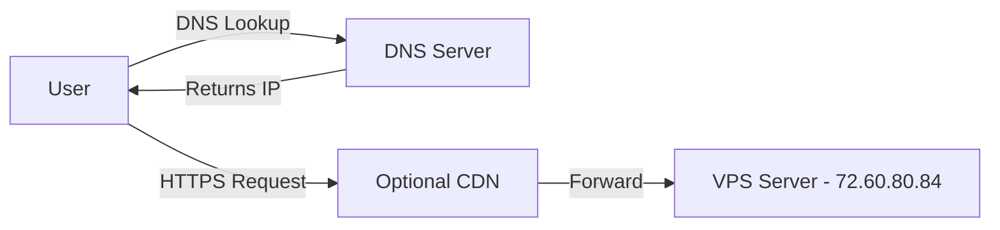

**Purpose**: Handle external traffic and DNS resolution

**Components**:
- DNS provider managing lianel.se domain
- Let's Encrypt for SSL certificates
- Optional CDN (not currently implemented)

### Layer 2: Ingress Layer

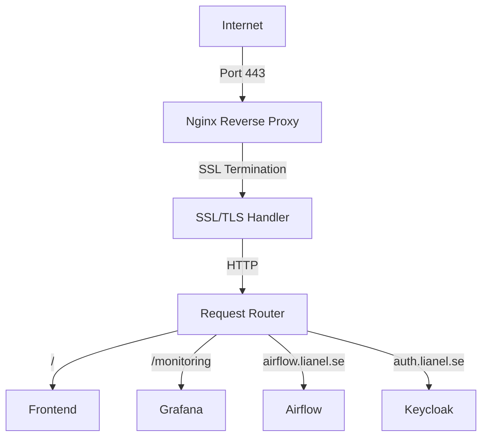

**Purpose**: SSL termination, routing, and load balancing

**Key Features**:
- SSL/TLS termination
- Virtual host routing
- Rate limiting
- Proxy buffering for large headers
- Security headers injection

### Layer 3: Authentication Layer

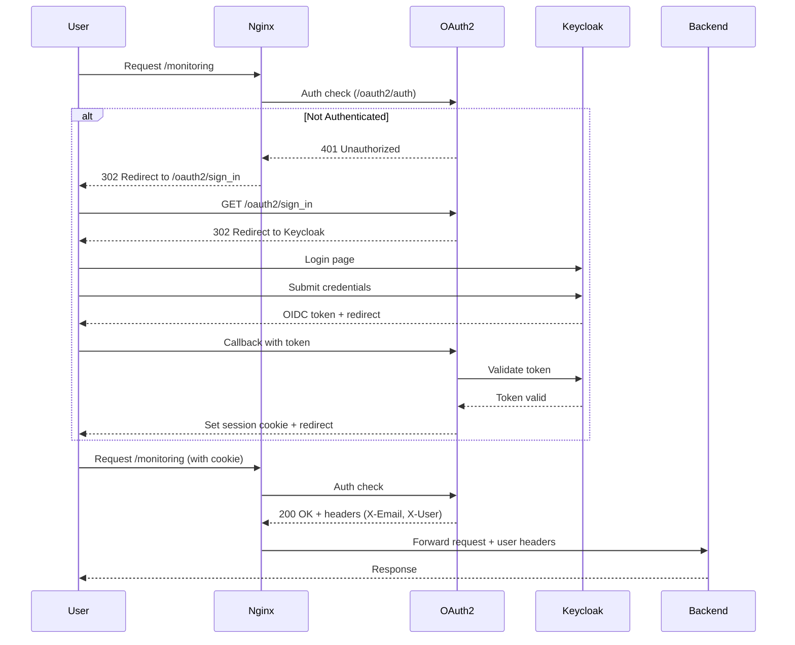

**Purpose**: Centralized authentication and authorization

**Components**:
- **OAuth2 Proxy**: Authentication gateway
- **Keycloak**: Identity provider (IdP)
- **Session Management**: Cookie-based sessions

**Security Features**:
- OIDC/OAuth2 protocol
- PKCE (Proof Key for Code Exchange)
- Secure cookies (HttpOnly, Secure, SameSite)
- Token refresh
- Session timeout

### Layer 4: Application Layer

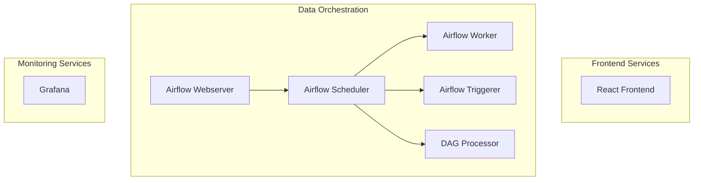

**Purpose**: Business logic and user interfaces

**Characteristics**:
- Stateless (except Airflow state in DB)
- Horizontally scalable (Airflow workers)
- Container-based deployment
- Auto-restart on failure

### Layer 5: Data Layer

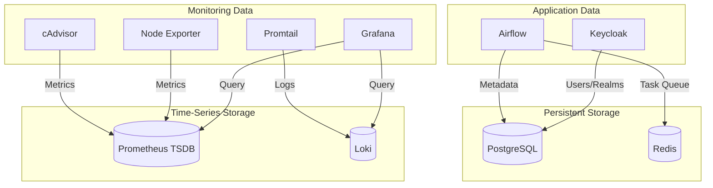

**Purpose**: Data persistence and retrieval

**Storage Types**:
- **Relational**: PostgreSQL for structured data
- **Cache/Queue**: Redis for temporary data
- **Time-Series**: Prometheus for metrics
- **Logs**: Loki for log aggregation

### Layer 6: Monitoring Layer

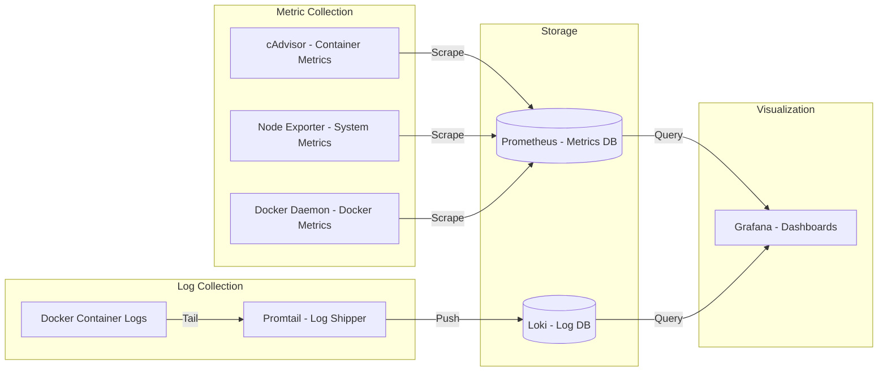

**Purpose**: System observability and alerting

**Metrics Collected**:
- Container CPU, memory, disk I/O
- System CPU, memory, disk, network
- Docker daemon statistics
- Application logs

## Component Interactions

### Frontend Request Flow

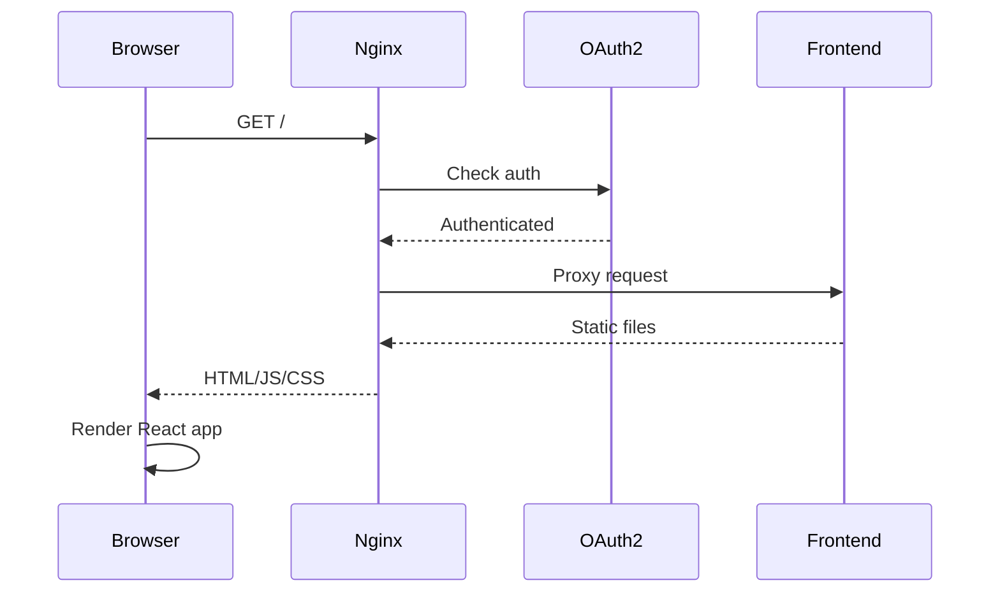

### Airflow Task Execution Flow

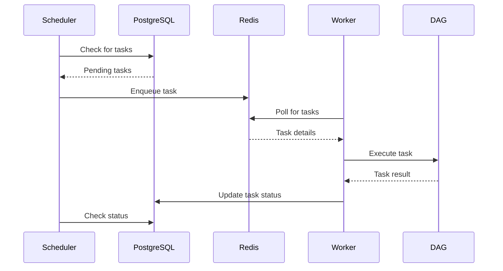

### Monitoring Data Flow

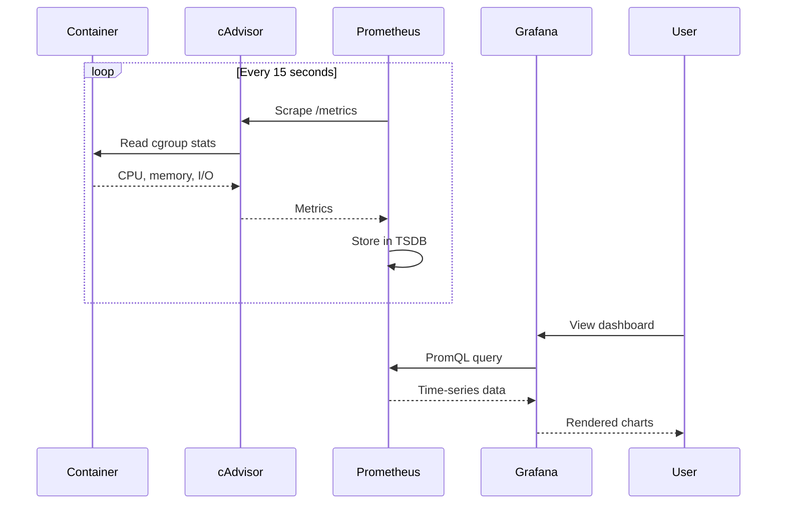

## Design Patterns

### 1. Reverse Proxy Pattern
**Implementation**: Nginx as single entry point

**Benefits**:
- Centralized SSL termination
- Single point for security policies
- Easy service routing
- Load balancing capability

### 2. Sidecar Pattern
**Implementation**: Promtail alongside containers

**Benefits**:
- Decoupled log collection
- No application code changes
- Centralized log aggregation

### 3. Gateway Pattern
**Implementation**: OAuth2 Proxy as auth gateway

**Benefits**:
- Centralized authentication
- No auth code in applications
- Consistent security policy
- Easy to add new services

### 4. Service Discovery Pattern
**Implementation**: Docker DNS

**Benefits**:
- Automatic service resolution
- No hardcoded IPs
- Dynamic container addressing

### 5. Configuration Management Pattern
**Implementation**: Environment variables + mounted configs

**Benefits**:
- Separation of config from code
- Easy environment-specific settings
- Secure secret management

## Scalability Considerations

### Current Limitations
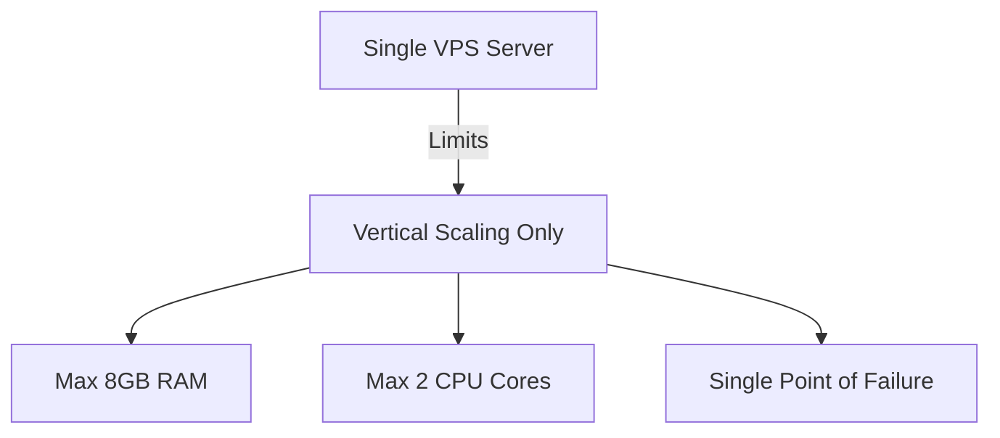

### Horizontal Scaling Opportunities
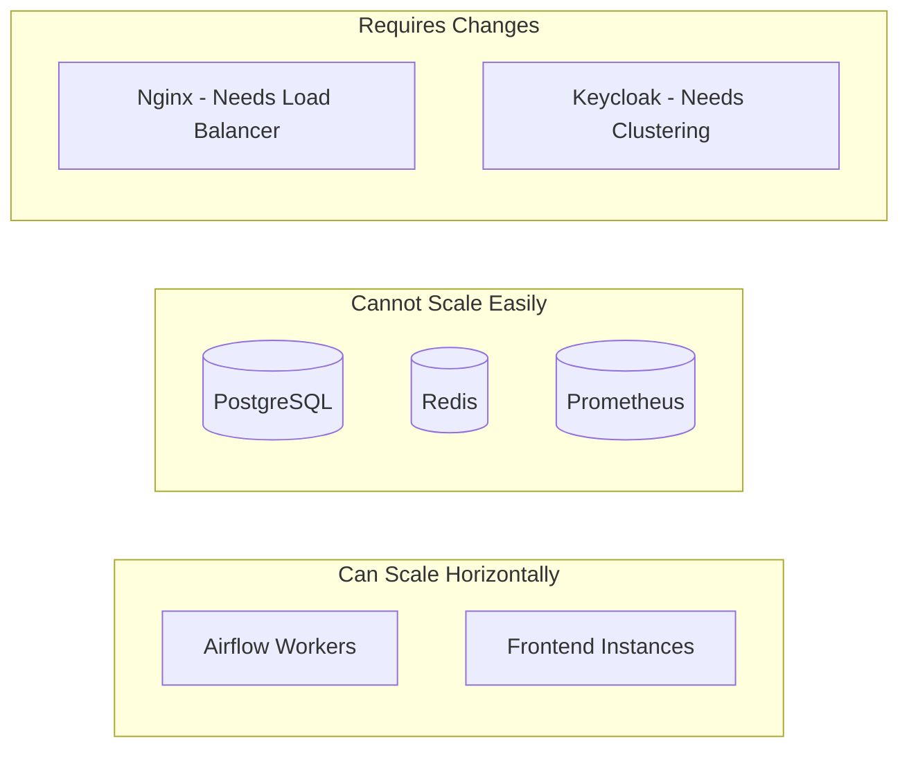

### Future Architecture (Multi-Server)

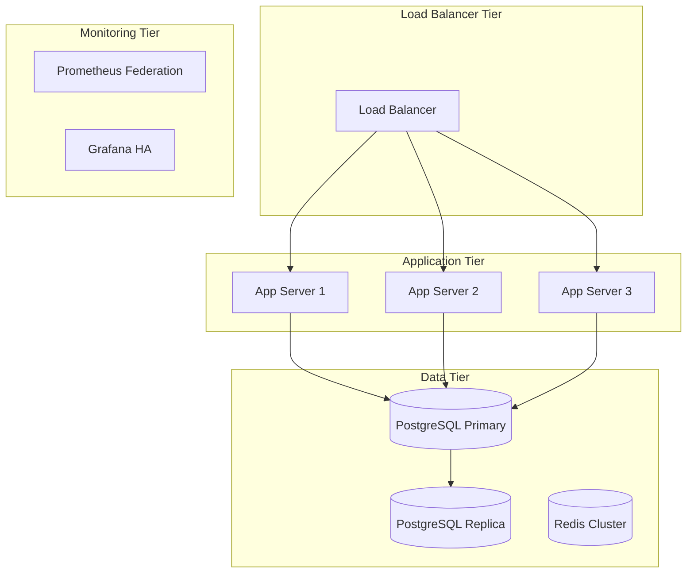

## Security Architecture

### Defense in Depth

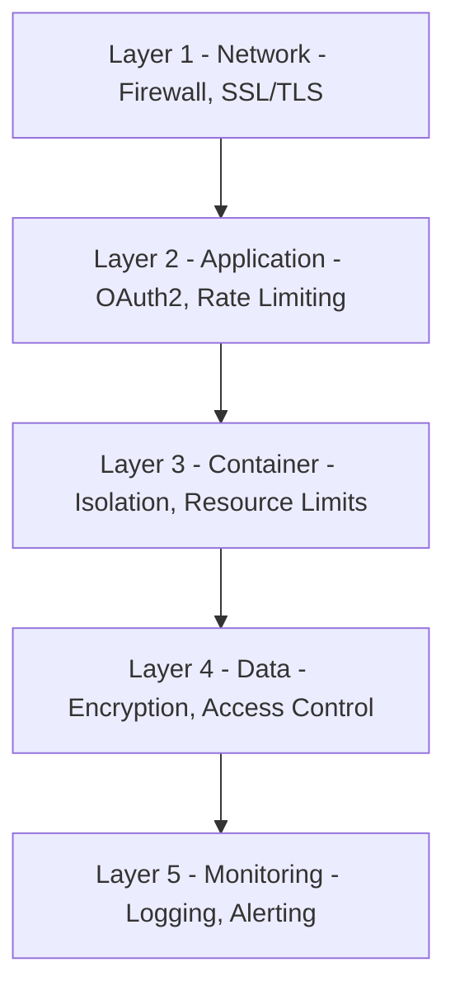

### Trust Boundaries

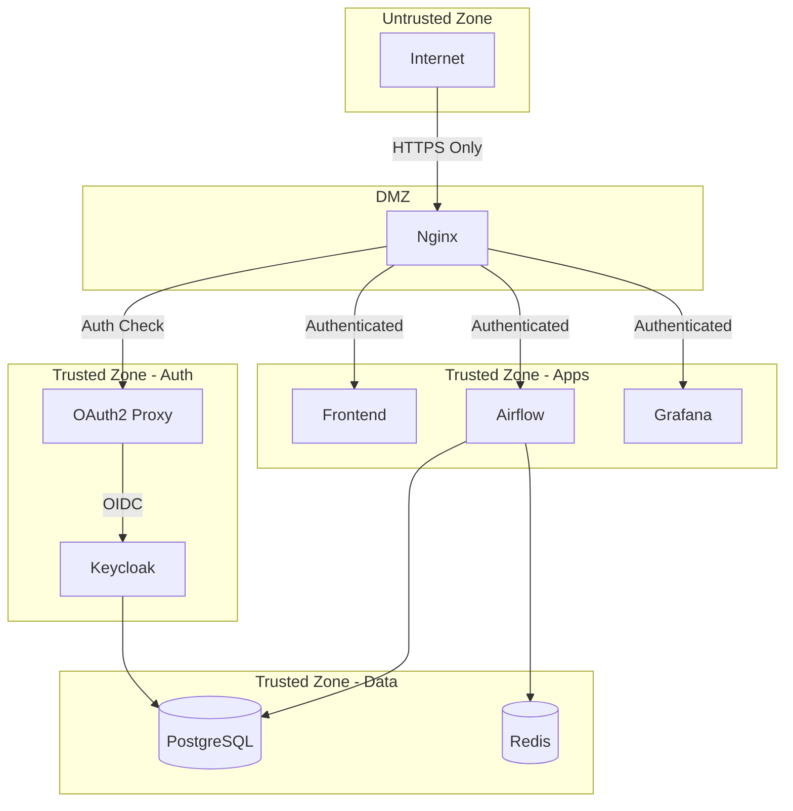

## Failure Modes and Recovery

### Single Points of Failure

| Component | Impact | Mitigation | Recovery Time |
|-----------|--------|------------|---------------|
| VPS Server | Total outage | Backups, monitoring | 1-2 hours |
| Nginx | No external access | Auto-restart | 30 seconds |
| PostgreSQL | Airflow/Keycloak down | Backups, replication | 15-30 minutes |
| Keycloak | No new logins | Auto-restart, session cache | 1-2 minutes |
| OAuth2 Proxy | No authentication | Auto-restart | 30 seconds |

### Recovery Procedures

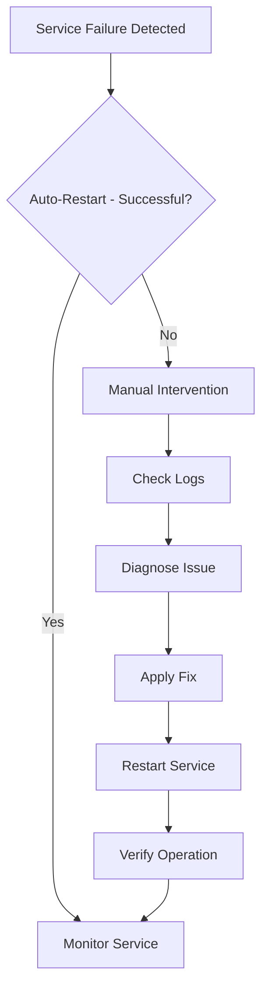

## Performance Optimization

### Current Optimizations
1. **Nginx**: Gzip compression, proxy caching
2. **Frontend**: Static file serving, CDN-ready
3. **Prometheus**: Recording rules for complex queries
4. **Docker**: Resource limits prevent resource exhaustion
5. **PostgreSQL**: Connection pooling

### Monitoring Performance

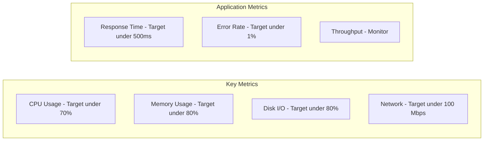

## Technology Decisions

### Why Docker Compose?
- **Pros**: Simple, single-server deployment, easy to understand
- **Cons**: No orchestration, manual scaling, single point of failure
- **Alternative**: Kubernetes (overkill for current scale)

### Why Keycloak?
- **Pros**: Full-featured IAM, OIDC support, user management
- **Cons**: Resource-heavy, complex configuration
- **Alternative**: Auth0 (SaaS, costs money)

### Why Prometheus + Loki?
- **Pros**: Industry standard, powerful querying, Grafana integration
- **Cons**: Storage overhead, retention limits
- **Alternative**: ELK Stack (more complex), Cloud services (costs)

### Why Single VPS?
- **Pros**: Cost-effective, simple operations, sufficient for current load
- **Cons**: No high availability, limited scalability
- **Alternative**: Multi-server cluster (higher cost, complexity)
