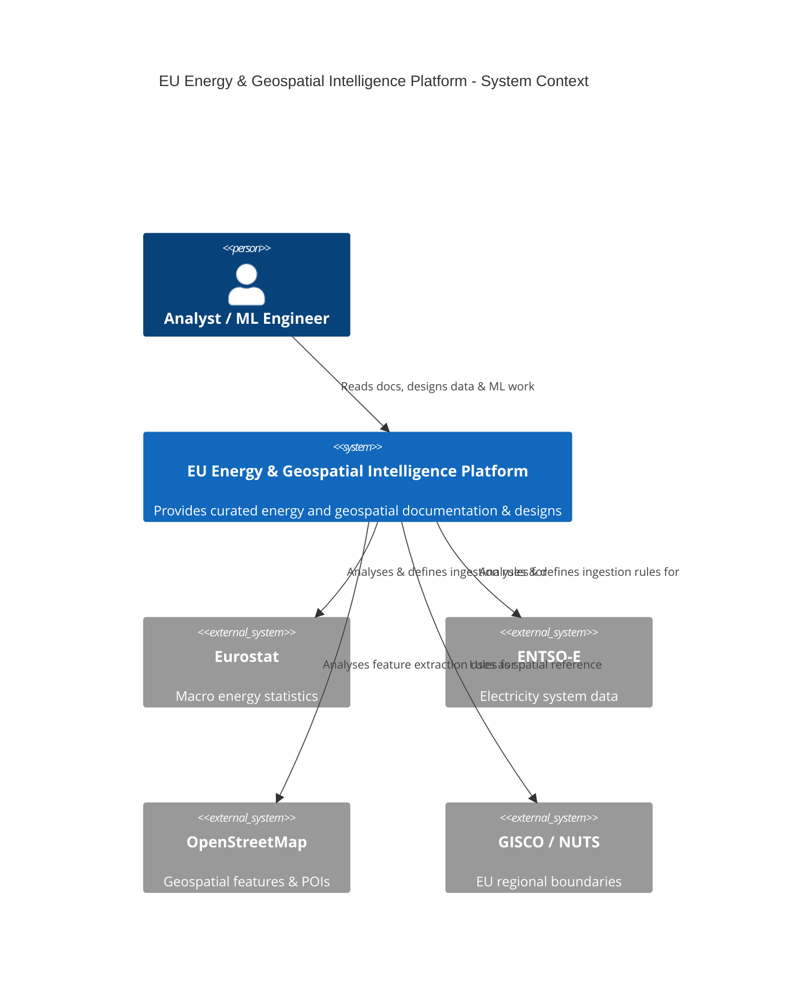

# D17 — C4 Level 1: Context Diagram  
Version 1.0

```mermaid
C4Context
    title EU Energy & Geospatial Intelligence Platform - System Context
    Person(user, "Analyst / ML Engineer")
    System(system, "EU Energy & Geospatial Intelligence Platform", "Provides curated energy and geospatial documentation & designs")
    System_Ext(eurostat, "Eurostat", "Macro energy statistics")
    System_Ext(entsoe, "ENTSO-E", "Electricity system data")
    System_Ext(osm, "OpenStreetMap", "Geospatial features & POIs")
    System_Ext(nuts, "GISCO / NUTS", "EU regional boundaries")

    Rel(user, system, "Reads docs, designs data & ML work")
    Rel(system, eurostat, "Analyses & defines ingestion rules for")
    Rel(system, entsoe, "Analyses & defines ingestion rules for")
    Rel(system, osm, "Analyses feature extraction rules for")
    Rel(system, nuts, "Uses as spatial reference")
```
