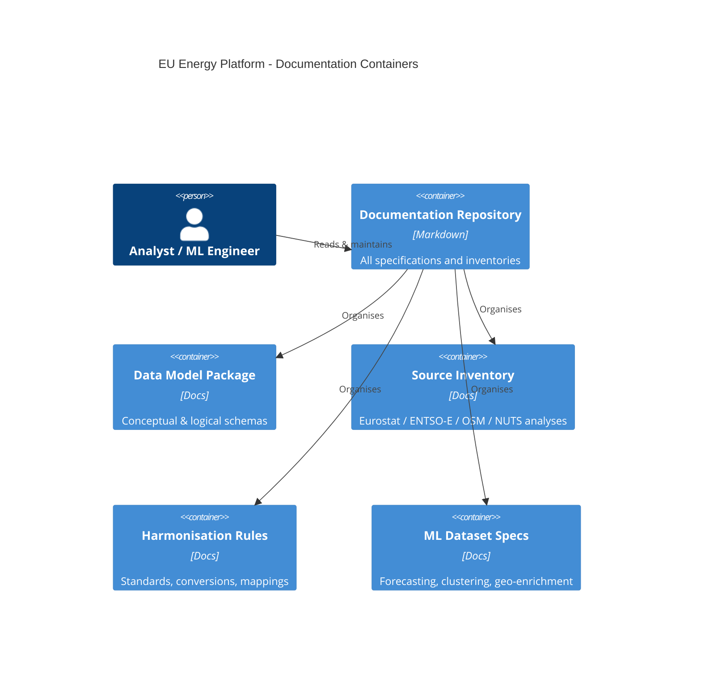

# D18 — C4 Level 2: Container View  
Version 1.0

```mermaid
C4Container
    title EU Energy Platform - Documentation Containers
    Person(user, "Analyst / ML Engineer")

    Container(docRepo, "Documentation Repository", "Markdown", "All specifications and inventories")
    Container(dataModel, "Data Model Package", "Docs", "Conceptual & logical schemas")
    Container(sourceInv, "Source Inventory", "Docs", "Eurostat / ENTSO-E / OSM / NUTS analyses")
    Container(harmRules, "Harmonisation Rules", "Docs", "Standards, conversions, mappings")
    Container(mlSpecs, "ML Dataset Specs", "Docs", "Forecasting, clustering, geo-enrichment")

    Rel(user, docRepo, "Reads & maintains")
    Rel(docRepo, sourceInv, "Organises")
    Rel(docRepo, dataModel, "Organises")
    Rel(docRepo, harmRules, "Organises")
    Rel(docRepo, mlSpecs, "Organises")
```
