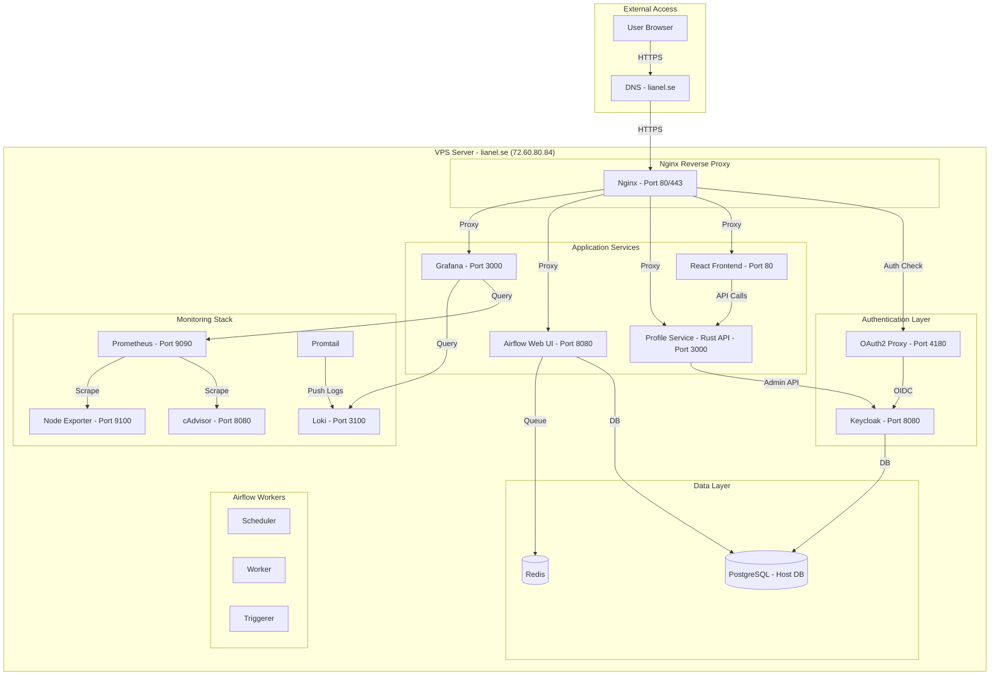
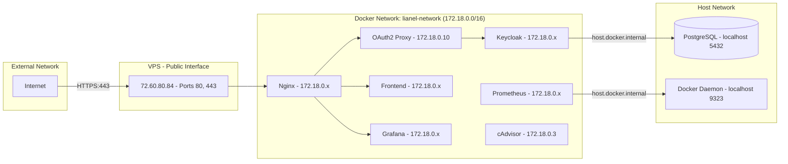
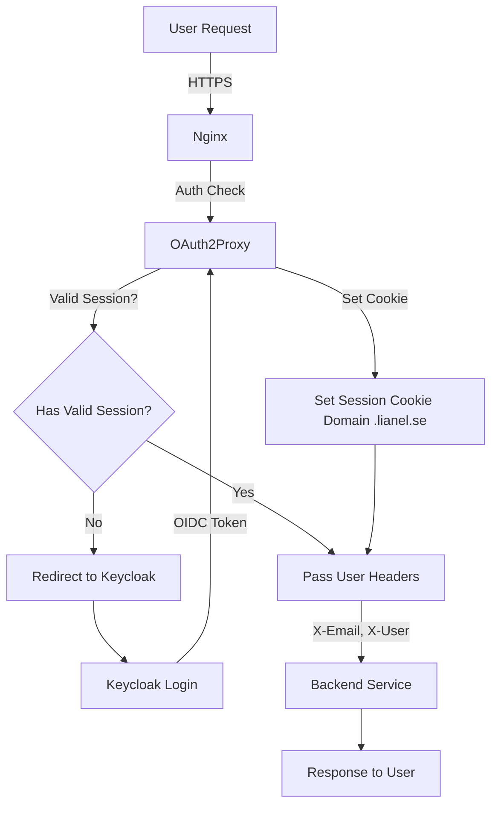
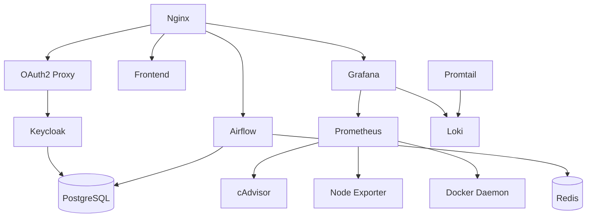

# Lianel Infrastructure - System Overview

## Executive Summary

The Lianel infrastructure is a containerized web application platform deployed on a single VPS server, providing a React frontend, Apache Airflow data orchestration, and comprehensive monitoring with Single Sign-On (SSO) authentication across all services.

## System Architecture



## Domain Structure

| Domain | Purpose | Backend Service |
|--------|---------|----------------|
| `lianel.se` | Main website | React Frontend |
| `www.lianel.se` | Main website (canonical) | React Frontend |
| `www.lianel.se/monitoring` | Grafana dashboards | Grafana |
| `monitoring.lianel.se` | Grafana (subdomain) | Grafana |
| `airflow.lianel.se` | Airflow web UI | Airflow |
| `auth.lianel.se` | Keycloak SSO | Keycloak |

## Technology Stack

### Frontend
- **Framework**: React 18
- **Build Tool**: Create React App
- **Container**: Nginx serving static files

### Backend Services
- **Profile Service**: Rust-based API service for user profile management
- **Orchestration**: Apache Airflow 3.1.3
- **Authentication**: Keycloak (latest)
- **Auth Proxy**: OAuth2 Proxy (latest)

### Monitoring
- **Metrics**: Prometheus 2.54.1
- **Visualization**: Grafana 11.3.0
- **Logs**: Loki 3.0.0 + Promtail 3.0.0
- **Container Metrics**: cAdvisor 0.47.0
- **System Metrics**: Node Exporter 1.8.2

### Infrastructure
- **Reverse Proxy**: Nginx (latest)
- **Database**: PostgreSQL (host-level)
- **Cache/Queue**: Redis (latest)
- **Container Runtime**: Docker with Docker Compose
- **SSL**: Let's Encrypt certificates

## Network Architecture



## Security Architecture



## Deployment Model

- **Environment**: Single VPS server
- **OS**: Ubuntu/Debian Linux
- **Container Orchestration**: Docker Compose
- **Configuration Management**: Environment files (.env)
- **Service Discovery**: Docker DNS
- **Storage**: Docker volumes + host filesystem

## Key Features

1. **Single Sign-On (SSO)**: Unified authentication across all services via Keycloak
2. **OAuth2 Proxy**: Centralized authentication gateway
3. **SSL/TLS**: Automatic HTTPS with Let's Encrypt
4. **Monitoring**: Comprehensive metrics and logs collection
5. **High Availability**: Automatic container restart policies
6. **Scalability**: Airflow worker can be scaled horizontally

## Service Dependencies



## Data Flow

### User Authentication Flow
1. User accesses `https://www.lianel.se`
2. Nginx checks authentication via OAuth2 Proxy
3. If not authenticated, redirect to Keycloak login
4. User logs in with credentials
5. Keycloak issues OIDC token
6. OAuth2 Proxy validates token and sets session cookie
7. User is redirected back to original URL
8. Subsequent requests use session cookie

### Monitoring Data Flow
1. cAdvisor collects container metrics from Docker
2. Node Exporter collects system metrics
3. Prometheus scrapes metrics every 15 seconds
4. Promtail tails Docker container logs
5. Promtail pushes logs to Loki
6. Grafana queries both Prometheus and Loki
7. Users view dashboards via Grafana UI

## File Structure

```
lianel/dc/
├── docker-compose.yaml              # Main compose file
├── docker-compose.airflow.yaml      # Airflow services
├── docker-compose.frontend.yaml     # React frontend
├── docker-compose.monitoring.yaml   # Monitoring stack
├── docker-compose.oauth2-proxy.yaml # Auth services
├── docker-compose.infra.yaml        # Infrastructure
├── .env                             # Environment variables
├── nginx/
│   └── config/
│       └── nginx.conf               # Nginx configuration
├── monitoring/
│   ├── prometheus/
│   │   ├── prometheus.yml           # Prometheus config
│   │   └── recording-rules.yml      # Recording rules
│   ├── grafana/
│   │   └── provisioning/            # Dashboards & datasources
│   ├── loki/
│   └── promtail/
├── frontend/                        # React application
└── dags/                           # Airflow DAGs
```

## Operational Characteristics

- **Uptime Target**: 99.9%
- **Backup Strategy**: Database backups, volume snapshots
- **Update Strategy**: Rolling updates via Docker Compose
- **Monitoring**: 24/7 via Grafana dashboards
- **Log Retention**: 15 days (Prometheus), configurable (Loki)
- **SSL Certificate Renewal**: Automatic via Let's Encrypt

## Next Steps

For detailed information, see:
- [Technical Specifications](./02-TECHNICAL-SPECIFICATIONS.md)
- [Architecture Details](./03-ARCHITECTURE.md)
- [Deployment Guide](./04-DEPLOYMENT-GUIDE.md)
- [Monitoring Setup](./05-MONITORING-SETUP.md)
- [Security Configuration](./06-SECURITY-CONFIGURATION.md)
