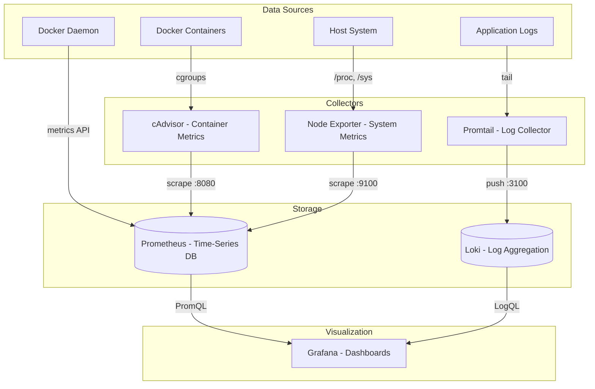

# Monitoring Setup Documentation

## Overview

The monitoring stack provides comprehensive observability for the Lianel infrastructure through metrics collection, log aggregation, and visualization.

## Monitoring Architecture



## Components

### Prometheus

**Purpose**: Time-series metrics storage and querying

**Configuration**: `/root/lianel/dc/monitoring/prometheus/prometheus.yml`

```yaml
global:
  scrape_interval: 15s
  evaluation_interval: 15s

rule_files:
  - "recording-rules.yml"

scrape_configs:
  - job_name: "prometheus"
    static_configs:
      - targets: ["localhost:9090"]

  - job_name: "node-exporter"
    static_configs:
      - targets: ["node-exporter:9100"]

  - job_name: "cadvisor"
    static_configs:
      - targets: ["172.18.0.3:8080"]  # cAdvisor IP

  - job_name: "docker-daemon"
    static_configs:
      - targets: ["host.docker.internal:9323"]
```

**Recording Rules**: `/root/lianel/dc/monitoring/prometheus/recording-rules.yml`

```yaml
groups:
  - name: container_names
    interval: 30s
    rules:
      - record: container_cpu_usage:rate5m
        expr: |
          label_replace(
            rate(container_cpu_usage_seconds_total{id=~"/system.slice/docker-(.+).scope"}[5m]),
            "container_id", "$1", "id", "/system.slice/docker-(.+).scope"
          )
      
      - record: container_memory:bytes
        expr: |
          label_replace(
            container_memory_usage_bytes{id=~"/system.slice/docker-(.+).scope"},
            "container_id", "$1", "id", "/system.slice/docker-(.+).scope"
          )
```

**Key Metrics**:
- `up`: Target availability
- `container_cpu_usage_seconds_total`: Container CPU usage
- `container_memory_usage_bytes`: Container memory usage
- `node_cpu_seconds_total`: System CPU usage
- `node_memory_MemAvailable_bytes`: Available memory
- `node_network_receive_bytes_total`: Network RX
- `node_network_transmit_bytes_total`: Network TX

**Access**: Internal only (port 9090)

**Retention**: 15 days

### Grafana

**Purpose**: Metrics and logs visualization

**Configuration**: Environment variables in `docker-compose.monitoring.yaml`

```yaml
environment:
  - GF_SERVER_ROOT_URL=https://www.lianel.se/monitoring
  - GF_SERVER_SERVE_FROM_SUB_PATH=true
  - GF_AUTH_PROXY_ENABLED=true
  - GF_AUTH_PROXY_HEADER_NAME=X-Email
  - GF_AUTH_PROXY_AUTO_SIGN_UP=true
  - GF_USERS_AUTO_ASSIGN_ORG_ROLE=Viewer
```

**Data Sources**:
1. **Prometheus**: `http://prometheus:9090`
2. **Loki**: `http://loki:3100`

**Dashboards**:
1. **Docker Containers (Working)** (`docker-containers-working`)
   - Container CPU usage
   - Container memory usage
   - Host network I/O
   - System resource gauges

2. **System Overview** (`system-overview`)
   - Overall system metrics
   - Disk usage
   - Network traffic

3. **Docker Overview** (`docker-overview`)
   - Container states
   - Docker daemon metrics

**Access**: https://www.lianel.se/monitoring/ (SSO required)

### cAdvisor

**Purpose**: Container metrics collection

**Configuration**: Command-line flags in `docker-compose.monitoring.yaml`

```yaml
command:
  - '--store_container_labels=true'
  - '--whitelisted_container_labels=io.kubernetes.container.name'
  - '--housekeeping_interval=10s'
```

**Limitations**:
- With systemd cgroups: Container names not exposed
- Network metrics only at host level
- Container IDs shown as systemd paths

**Metrics Exposed**:
- CPU usage per container
- Memory usage per container
- Filesystem I/O per container
- Network I/O (host-level only)

**Access**: Internal only (port 8080)

### Node Exporter

**Purpose**: System-level metrics collection

**Metrics Collected**:
- CPU usage by mode (user, system, idle, iowait)
- Memory usage (total, available, free, cached)
- Disk I/O (reads, writes, IOPS)
- Network I/O by interface
- Filesystem usage
- System load averages

**Access**: Internal only (port 9100)

### Loki

**Purpose**: Log aggregation and storage

**Configuration**: `/root/lianel/dc/monitoring/loki/local-config.yaml`

**Features**:
- Label-based indexing
- LogQL query language
- Efficient storage
- Integration with Grafana

**Access**: Internal only (port 3100)

### Promtail

**Purpose**: Log collection and shipping

**Configuration**: `/root/lianel/dc/monitoring/promtail/config.yml`

**Log Sources**:
- Docker container logs: `/var/lib/docker/containers`
- Docker socket: `/var/run/docker.sock`

**Label Extraction**:
- Container name
- Container ID
- Image name
- Log stream (stdout/stderr)

## Dashboard Configuration

### Container ID Mapping

Since cAdvisor with systemd cgroups doesn't expose container names, use this mapping:

| Container ID (first 12 chars) | Container Name |
|-------------------------------|----------------|
| 8dbe97b5eff2 | cadvisor |
| ea9b1c80b69c | grafana |
| deb26c8d5db9 | oauth2-proxy |
| 205d072e742f | keycloak |
| 0be88294e82d | lianel-frontend |
| 7e279a6799dd | prometheus |
| 7bf3d030488c | node-exporter |
| 1b5238236b62 | promtail |
| 584208becdf6 | loki |
| 326d5f26020d | airflow-worker |
| 6b7bf8c66802 | airflow-apiserver |
| b72bbbc3db1d | airflow-scheduler |
| 4d96c636e41f | nginx-proxy |

**Update Mapping**:
```bash
ssh root@lianel.se "docker ps --format '{{.ID}}\t{{.Names}}'"
```

### Key Queries

**Container CPU Usage**:
```promql
container_cpu_usage:rate5m * 100
```

**Container Memory Usage (MB)**:
```promql
container_memory:bytes / 1024 / 1024
```

**Host CPU Usage**:
```promql
1 - avg(rate(node_cpu_seconds_total{mode="idle"}[5m]))
```

**Host Memory Usage**:
```promql
1 - (node_memory_MemAvailable_bytes / node_memory_MemTotal_bytes)
```

**Network I/O by Interface**:
```promql
rate(node_network_receive_bytes_total{device!~"lo|veth.*"}[5m]) / 1024
rate(node_network_transmit_bytes_total{device!~"lo|veth.*"}[5m]) / 1024
```

## Alerting (Future Implementation)

### Recommended Alerts

```yaml
groups:
  - name: system_alerts
    rules:
      - alert: HighCPUUsage
        expr: (1 - avg(rate(node_cpu_seconds_total{mode="idle"}[5m]))) > 0.8
        for: 5m
        annotations:
          summary: "High CPU usage detected"
          
      - alert: HighMemoryUsage
        expr: (1 - (node_memory_MemAvailable_bytes / node_memory_MemTotal_bytes)) > 0.9
        for: 5m
        annotations:
          summary: "High memory usage detected"
          
      - alert: ContainerDown
        expr: up{job="cadvisor"} == 0
        for: 1m
        annotations:
          summary: "cAdvisor is down"
          
      - alert: DiskSpaceLow
        expr: (node_filesystem_avail_bytes{mountpoint="/"} / node_filesystem_size_bytes{mountpoint="/"}) < 0.1
        for: 5m
        annotations:
          summary: "Disk space below 10%"
```

## Troubleshooting

### No Metrics in Grafana

**Check Prometheus Targets**:
```bash
curl http://localhost:9090/api/v1/targets | jq '.data.activeTargets[] | {job: .labels.job, health: .health}'
```

**Expected Output**:
```json
{"job": "prometheus", "health": "up"}
{"job": "node-exporter", "health": "up"}
{"job": "cadvisor", "health": "up"}
{"job": "docker-daemon", "health": "down"}  // May be down if not configured
```

**Fix Down Targets**:
```bash
# Check if service is running
docker ps | grep <service-name>

# Check if service is accessible
docker exec prometheus wget -qO- http://<service>:<port>/metrics

# Check Prometheus config
docker exec prometheus cat /etc/prometheus/prometheus.yml

# Reload Prometheus
docker exec prometheus kill -HUP 1
```

### Container Metrics Not Showing

**Verify cAdvisor is collecting**:
```bash
curl -s http://localhost:8080/metrics | grep container_cpu_usage_seconds_total | head -5
```

**Check for systemd paths**:
```bash
curl -s http://localhost:8080/metrics | grep 'id="/system.slice/docker-'
```

**If no metrics**:
```bash
# Restart cAdvisor
docker-compose -f docker-compose.monitoring.yaml restart cadvisor

# Check logs
docker logs cadvisor

# Verify Docker socket access
docker exec cadvisor ls -la /var/run/docker.sock
```

### Grafana Shows "No Data"

**Check Data Source**:
1. Go to Configuration > Data Sources
2. Click on Prometheus
3. Click "Test" button
4. Should show "Data source is working"

**Check Dashboard Queries**:
1. Open dashboard
2. Edit panel
3. Check query syntax
4. Run query in Prometheus directly

**Common Issues**:
- Wrong metric name
- Missing labels
- Time range too narrow
- Recording rules not evaluated

### High Resource Usage

**Prometheus using too much memory**:
```bash
# Reduce retention
docker exec prometheus vi /etc/prometheus/prometheus.yml
# Change: --storage.tsdb.retention.time=7d

# Restart
docker-compose -f docker-compose.monitoring.yaml restart prometheus
```

**cAdvisor using too much CPU**:
```bash
# Increase housekeeping interval
# Edit docker-compose.monitoring.yaml
command:
  - '--housekeeping_interval=30s'  # Increase from 10s

# Restart
docker-compose -f docker-compose.monitoring.yaml restart cadvisor
```

## Maintenance

### Update Container Mapping

When containers are recreated, IDs change. Update the mapping:

```bash
# Generate new mapping
ssh root@lianel.se "/root/lianel/dc/monitoring/update-container-mapping.sh"

# Update dashboard reference panel manually in Grafana
```

### Clean Up Old Metrics

```bash
# Prometheus automatically removes old data based on retention
# To manually clean up:
docker exec prometheus rm -rf /prometheus/*
docker-compose -f docker-compose.monitoring.yaml restart prometheus
```

### Backup Dashboards

```bash
# Export dashboards
docker exec grafana grafana-cli admin export-dashboard <dashboard-uid>

# Or backup Grafana data volume
docker run --rm -v grafana-data:/data -v $(pwd):/backup alpine tar czf /backup/grafana-backup.tar.gz /data
```

### Restore Dashboards

```bash
# Restore from volume backup
docker run --rm -v grafana-data:/data -v $(pwd):/backup alpine tar xzf /backup/grafana-backup.tar.gz -C /

# Restart Grafana
docker-compose -f docker-compose.monitoring.yaml restart grafana
```

## Performance Tuning

### Prometheus

```yaml
# Reduce scrape frequency for less critical targets
scrape_configs:
  - job_name: "node-exporter"
    scrape_interval: 30s  # Instead of 15s
```

### Grafana

```yaml
# Reduce dashboard refresh rate
# In dashboard settings: Refresh = 30s instead of 5s
```

### cAdvisor

```yaml
# Disable unused metrics
command:
  - '--disable_metrics=disk,diskIO,accelerator'
```

## Monitoring Best Practices

1. **Set up alerts** for critical metrics
2. **Review dashboards** regularly
3. **Monitor disk usage** of Prometheus/Loki
4. **Keep retention** reasonable (7-15 days)
5. **Document** custom dashboards
6. **Test** monitoring during deployments
7. **Backup** Grafana dashboards
8. **Update** container ID mappings after restarts

## Access and Permissions

### Grafana Users

- **Admin**: Full access (via GF_SECURITY_ADMIN_USER)
- **SSO Users**: Viewer role by default
- **Upgrade to Editor**: Manual in Grafana UI

### Prometheus

- No authentication (internal only)
- Access via Grafana or port-forward

### Loki

- No authentication (internal only)
- Access via Grafana only
