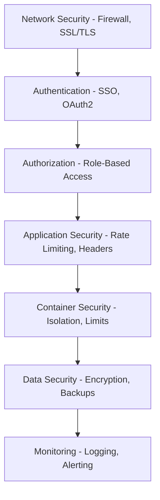
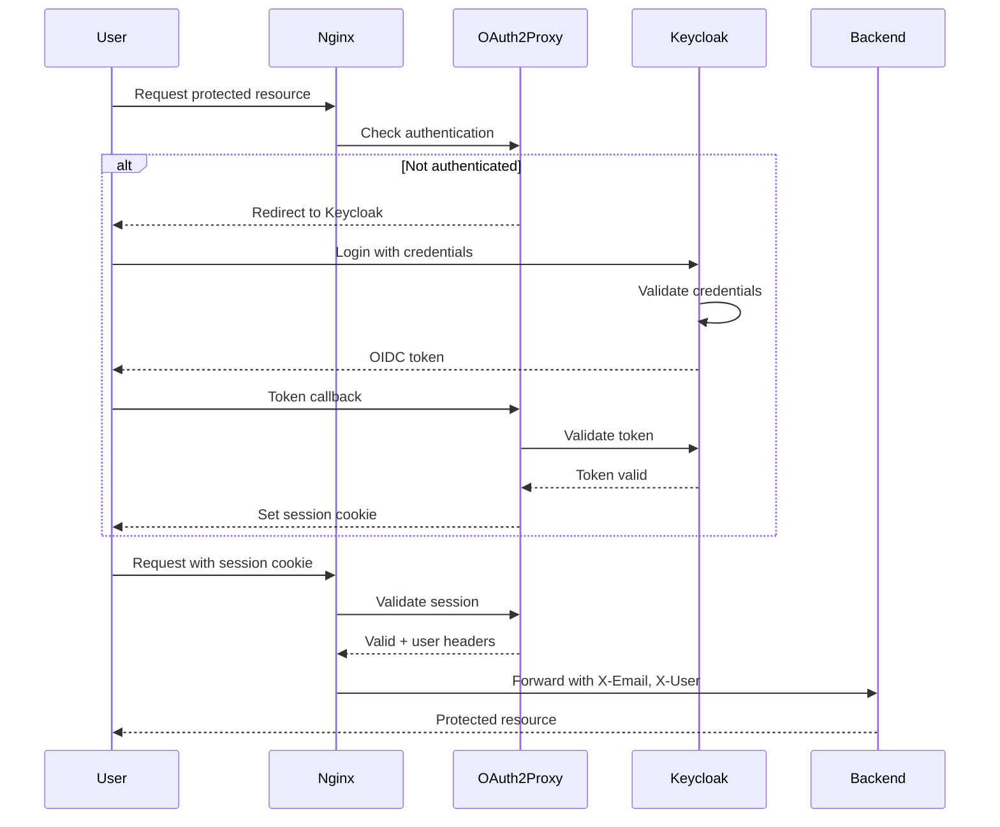
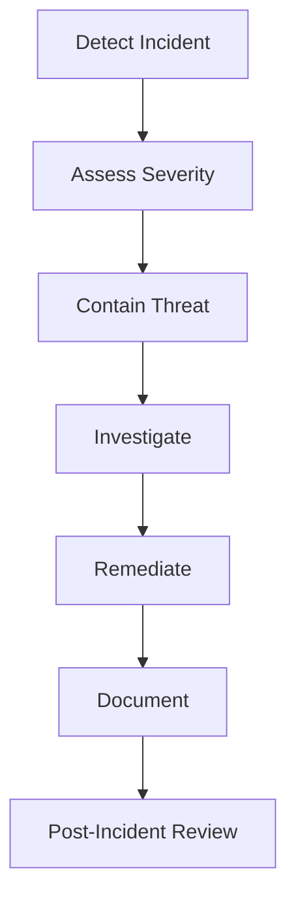

# Security Configuration Documentation

## Security Overview

The Lianel infrastructure implements multiple layers of security following defense-in-depth principles.

## Security Layers



## Network Security

### Firewall Configuration

**UFW Rules**:
```bash
# Allow only necessary ports
sudo ufw allow 22/tcp   # SSH
sudo ufw allow 80/tcp   # HTTP (redirects to HTTPS)
sudo ufw allow 443/tcp  # HTTPS
sudo ufw deny from any to any  # Deny all other traffic
sudo ufw enable
```

**Verification**:
```bash
sudo ufw status verbose
```

### SSL/TLS Configuration

**Certificates**: Let's Encrypt (automatic renewal)

**Nginx SSL Configuration**:
```nginx
# SSL protocols
ssl_protocols TLSv1.2 TLSv1.3;

# Cipher suites (Mozilla Intermediate)
ssl_ciphers ECDHE-ECDSA-AES128-GCM-SHA256:ECDHE-RSA-AES128-GCM-SHA256:...;
ssl_prefer_server_ciphers off;

# Session settings
ssl_session_timeout 1d;
ssl_session_cache shared:SSL:50m;
ssl_session_tickets off;

# HSTS
add_header Strict-Transport-Security "max-age=31536000; includeSubDomains" always;
```

**SSL Test**:
```bash
# Test SSL configuration
curl -I https://www.lianel.se

# Check SSL Labs rating
# Visit: https://www.ssllabs.com/ssltest/analyze.html?d=www.lianel.se
```

### Security Headers

**Nginx Headers**:
```nginx
add_header X-Frame-Options "SAMEORIGIN" always;
add_header X-Content-Type-Options "nosniff" always;
add_header X-XSS-Protection "1; mode=block" always;
add_header Referrer-Policy "strict-origin-when-cross-origin" always;
add_header Strict-Transport-Security "max-age=31536000; includeSubDomains" always;
```

**Verification**:
```bash
curl -I https://www.lianel.se | grep -E "X-Frame|X-Content|X-XSS|Referrer|Strict-Transport"
```

## Authentication and Authorization

### Single Sign-On (SSO) Architecture



### Keycloak Configuration

**Realm**: `lianel`

**Clients**:
1. **oauth2-proxy**
   - Client ID: `oauth2-proxy`
   - Protocol: `openid-connect`
   - Access Type: `confidential`
   - Valid Redirect URIs:
     - `https://www.lianel.se/oauth2/callback`
     - `https://monitoring.lianel.se/oauth2/callback`
     - `https://airflow.lianel.se/oauth2/callback`
     - `https://auth.lianel.se/oauth2/callback`
   - PKCE: Enabled (S256)

2. **grafana**
   - Client ID: `grafana`
   - Protocol: `openid-connect`
   - Access Type: `confidential`
   - Valid Redirect URIs:
     - `https://www.lianel.se/monitoring/*`
     - `https://monitoring.lianel.se/*`

**Security Settings**:
```yaml
Realm Settings:
  - SSL Required: external
  - Login with email: enabled
  - Duplicate emails: not allowed
  - Reset password: enabled
  - Edit username: disabled
  - Brute force protection: enabled
```

**User Management**:
```bash
# Create user via Keycloak admin console
# https://auth.lianel.se

# Or via CLI
docker exec keycloak /opt/keycloak/bin/kcadm.sh create users \
  -r lianel \
  -s username=newuser \
  -s email=user@example.com \
  -s enabled=true
```

### OAuth2 Proxy Configuration

**Key Settings**:
```yaml
OAUTH2_PROXY_PROVIDER: keycloak-oidc
OAUTH2_PROXY_OIDC_ISSUER_URL: https://auth.lianel.se/realms/lianel
OAUTH2_PROXY_CLIENT_ID: oauth2-proxy
OAUTH2_PROXY_CLIENT_SECRET: <secret>
OAUTH2_PROXY_COOKIE_SECRET: <secret>
OAUTH2_PROXY_COOKIE_SECURE: true
OAUTH2_PROXY_COOKIE_DOMAIN: .lianel.se
OAUTH2_PROXY_COOKIE_SAMESITE: lax
OAUTH2_PROXY_CODE_CHALLENGE_METHOD: S256
OAUTH2_PROXY_COOKIE_EXPIRE: 4h
OAUTH2_PROXY_COOKIE_REFRESH: 1h
OAUTH2_PROXY_USER_ID_CLAIM: preferred_username
OAUTH2_PROXY_OIDC_GROUPS_CLAIM: groups
```

**Note**: `OAUTH2_PROXY_BACKEND_LOGOUT_URL` is NOT configured. This ensures proper SSO behavior where users stay logged in across sessions. Logout clears OAuth2-proxy cookies but maintains Keycloak SSO session for seamless access across services.

**Session Security**:
- Cookies are HttpOnly (not accessible via JavaScript)
- Cookies are Secure (HTTPS only)
- SameSite=lax (CSRF protection)
- Domain-wide cookies (.lianel.se)
- 4-hour expiration with 1-hour refresh

**SSO Behavior**:
- Users stay logged in across all services (www.lianel.se, monitoring.lianel.se, airflow.lianel.se)
- Single Keycloak session shared across all applications
- **Logout Process**:
  1. Frontend calls `/oauth2/sign_out` which clears OAuth2-proxy cookies
  2. Redirects to Keycloak logout endpoint: `https://auth.lianel.se/realms/lianel/protocol/openid-connect/logout`
  3. User must click "Logout" button on Keycloak confirmation page
  4. Keycloak clears SSO session and redirects back to main site
  5. After logout, login will prompt for credentials (and MFA if OTP configured)
- **Note**: Browser cookies may persist - users may need to clear cookies or use incognito mode for full logout test

**MFA Configuration**:
- Multi-Factor Authentication is **REQUIRED** for all users in Browser flow
- "Browser - Conditional 2FA" subflow is set to **REQUIRED** (mandatory for all logins)
- OTP Form is set to **REQUIRED** (mandatory step in authentication flow)
- **MFA will ALWAYS prompt during login - users MUST have OTP configured to log in**
- Users must configure OTP before they can successfully authenticate:
  - Via Keycloak account console (https://auth.lianel.se/realms/lianel/account) - requires initial login
  - Admin-initiated required actions (`CONFIGURE_TOTP`) - recommended for new users
- **New users**: Admin should add `CONFIGURE_TOTP` as a required action before first login
- **Existing users**: Must configure OTP via account console or admin must add required action
- **Note**: Users without OTP configured will NOT be able to log in until OTP is configured

### Grafana Auth Proxy

**Configuration**:
```yaml
GF_AUTH_PROXY_ENABLED: true
GF_AUTH_PROXY_HEADER_NAME: X-Email
GF_AUTH_PROXY_HEADER_PROPERTY: email
GF_AUTH_PROXY_AUTO_SIGN_UP: true
GF_AUTH_PROXY_WHITELIST: 172.18.0.0/16  # Docker network only
GF_USERS_ALLOW_SIGN_UP: false
GF_USERS_AUTO_ASSIGN_ORG_ROLE: Viewer
```

**How it works**:
1. OAuth2 Proxy validates user
2. Nginx passes X-Email and X-User headers
3. Grafana trusts headers from whitelisted IPs
4. User is auto-created/logged in

## Application Security

### Rate Limiting

**Nginx Configuration**:
```nginx
# Define rate limit zones
limit_req_zone $binary_remote_addr zone=general:10m rate=10r/s;
limit_req_zone $binary_remote_addr zone=login:10m rate=5r/m;

# Apply to locations
location / {
    limit_req zone=general burst=20 nodelay;
}

location /oauth2/sign_in {
    limit_req zone=login burst=5 nodelay;
}
```

**Testing**:
```bash
# Test rate limiting
for i in {1..30}; do curl -I https://www.lianel.se; done
# Should see 429 (Too Many Requests) after burst
```

### Proxy Buffer Security

**Large Header Protection**:
```nginx
# Prevent buffer overflow from large OAuth2 tokens
proxy_buffer_size 128k;
proxy_buffers 4 256k;
proxy_busy_buffers_size 256k;
```

### Input Validation

**Airflow**:
- SQL injection protection via SQLAlchemy ORM
- XSS protection via template escaping
- CSRF tokens on forms

**Frontend**:
- React XSS protection (automatic escaping)
- Content Security Policy (CSP) headers
- Input sanitization

## Container Security

### Container Isolation

**Network Isolation**:
```yaml
# All containers on isolated bridge network
networks:
  lianel-network:
    driver: bridge
    internal: false  # Allows internet access
```

**Resource Limits**:
```yaml
# Example resource limits (not currently enforced)
services:
  frontend:
    deploy:
      resources:
        limits:
          cpus: '0.5'
          memory: 512M
        reservations:
          cpus: '0.25'
          memory: 256M
```

### Privileged Containers

**Only cAdvisor runs privileged**:
```yaml
cadvisor:
  privileged: true  # Required for container metrics
  volumes:
    - /:/rootfs:ro  # Read-only root filesystem
    - /sys:/sys:ro  # Read-only system info
```

**Security Justification**:
- Required for cgroup access
- All mounts are read-only
- No write access to host
- Isolated network

### Docker Socket Access

**Services with socket access**:
1. **cAdvisor**: Read-only, for metrics
2. **Promtail**: Read-only, for log collection

**Security Measures**:
```yaml
volumes:
  - /var/run/docker.sock:/var/run/docker.sock:ro  # Read-only
```

### Image Security

**Base Images**:
- Official images from Docker Hub
- Specific version tags (not `latest`)
- Regular updates

**Scanning** (recommended):
```bash
# Install Trivy
curl -sfL https://raw.githubusercontent.com/aquasecurity/trivy/main/contrib/install.sh | sh -s -- -b /usr/local/bin

# Scan images
trivy image nginx:latest
trivy image grafana/grafana:11.3.0
trivy image apache/airflow:3.1.3
```

## Data Security

### Secrets Management

**Environment Variables**:
```bash
# Stored in .env file
# Permissions: 600 (owner read/write only)
chmod 600 .env
```

**Secret Types**:
1. **Passwords**: PostgreSQL, Redis, Keycloak admin
2. **API Keys**: OAuth2 client secrets
3. **Encryption Keys**: Airflow Fernet key, OAuth2 cookie secret

**Secret Generation**:
```bash
# Generate strong password
openssl rand -base64 32

# Generate Fernet key (Airflow)
python -c "from cryptography.fernet import Fernet; print(Fernet.generate_key().decode())"

# Generate cookie secret (OAuth2)
python -c 'import os,base64; print(base64.urlsafe_b64encode(os.urandom(32)).decode())'
```

**Secret Rotation**:
```bash
# 1. Generate new secret
NEW_SECRET=$(openssl rand -base64 32)

# 2. Update .env file
sed -i "s/OLD_SECRET=.*/OLD_SECRET=$NEW_SECRET/" .env

# 3. Restart affected services
docker-compose -f docker-compose.oauth2-proxy.yaml restart
```

### Database Security

**PostgreSQL**:
```sql
-- Separate databases for each service
CREATE DATABASE airflow;
CREATE DATABASE keycloak;

-- Separate users with minimal privileges
CREATE USER airflow WITH PASSWORD '<secret>';
GRANT ALL PRIVILEGES ON DATABASE airflow TO airflow;

CREATE USER keycloak WITH PASSWORD '<secret>';
GRANT ALL PRIVILEGES ON DATABASE keycloak TO keycloak;
```

**Access Control**:
- PostgreSQL only accessible from localhost
- Containers access via `host.docker.internal`
- No external access

**Backup Encryption**:
```bash
# Encrypted backup
pg_dump airflow | gpg --encrypt --recipient admin@lianel.se > airflow_backup.sql.gpg

# Restore
gpg --decrypt airflow_backup.sql.gpg | psql airflow
```

### Data at Rest

**Docker Volumes**:
- Stored on host filesystem
- Protected by filesystem permissions
- Regular backups

**Sensitive Data**:
- Passwords hashed (bcrypt)
- Tokens encrypted (Fernet)
- SSL certificates protected (600 permissions)

### Data in Transit

**Internal Communication**:
- HTTP within Docker network (encrypted network not required)
- Docker network isolation provides security

**External Communication**:
- HTTPS only (TLS 1.2/1.3)
- Certificate pinning (HSTS)
- No mixed content

## Logging and Auditing

### Access Logs

**Nginx Access Logs**:
```nginx
log_format main '$remote_addr - $remote_user [$time_local] "$request" '
                '$status $body_bytes_sent "$http_referer" '
                '"$http_user_agent" "$http_x_forwarded_for"';

access_log /var/log/nginx/access.log main;
```

**View Logs**:
```bash
docker logs nginx-proxy | grep -E "GET|POST"
```

### Authentication Logs

**OAuth2 Proxy Logs**:
```bash
# View authentication events
docker logs oauth2-proxy | grep -E "AuthSuccess|AuthFailure"
```

**Keycloak Logs**:
```bash
# View login events
docker logs keycloak | grep -E "LOGIN|LOGOUT"
```

### Security Event Monitoring

**Failed Login Attempts**:
```bash
# Monitor failed logins
docker logs keycloak | grep "LOGIN_ERROR"
```

**Suspicious Activity**:
```bash
# Monitor rate limit hits
docker logs nginx-proxy | grep "429"

# Monitor 403 Forbidden
docker logs nginx-proxy | grep "403"
```

### Log Retention

**Loki**: Configurable (default: unlimited, limited by disk)
**Docker Logs**: Rotated automatically
**Nginx Logs**: Rotated by logrotate

## Compliance and Best Practices

### Security Checklist

- [x] HTTPS enforced for all external traffic
- [x] Strong passwords for all services
- [x] SSH key-based authentication
- [x] Firewall configured (UFW)
- [x] Regular security updates
- [x] Secrets stored securely
- [x] Rate limiting enabled
- [x] Security headers configured
- [x] Logging enabled
- [x] Backups configured
- [ ] Intrusion detection (recommended)
- [ ] Automated security scanning (recommended)
- [ ] Security incident response plan (recommended)

### Regular Security Tasks

**Weekly**:
- Review access logs for anomalies
- Check for failed login attempts
- Monitor resource usage

**Monthly**:
- Update Docker images
- Review user accounts
- Test backup restoration
- Rotate non-critical secrets

**Quarterly**:
- Security audit
- Penetration testing
- Update SSL certificates (automatic)
- Review and update firewall rules

**Annually**:
- Rotate all secrets
- Review security policies
- Update disaster recovery plan

## Incident Response

### Security Incident Procedure



### Common Incidents

**Unauthorized Access Attempt**:
1. Check logs: `docker logs nginx-proxy | grep 401`
2. Identify source IP
3. Block IP in firewall: `sudo ufw deny from <IP>`
4. Review authentication logs
5. Reset compromised credentials

**DDoS Attack**:
1. Identify attack pattern
2. Increase rate limits
3. Block source IPs/ranges
4. Enable Cloudflare (if available)
5. Contact hosting provider

**Container Compromise**:
1. Stop affected container
2. Preserve logs and state
3. Investigate compromise vector
4. Rebuild container from clean image
5. Update secrets
6. Deploy patched version

### Emergency Contacts

```yaml
Security Team:
  - Primary: <email>
  - Secondary: <email>

Hosting Provider:
  - Support: <phone/email>
  - Emergency: <phone>

External Resources:
  - CERT: https://www.cert.org
  - Security Advisories: <relevant sources>
```

## Security Hardening (Advanced)

### Additional Recommendations

**1. Implement Fail2Ban**:
```bash
sudo apt install fail2ban
sudo systemctl enable fail2ban
```

**2. Enable AppArmor/SELinux**:
```bash
# Check status
sudo aa-status

# Enable for Docker
sudo systemctl enable apparmor
```

**3. Implement Network Policies**:
```yaml
# Restrict container-to-container communication
# Requires Docker Swarm or Kubernetes
```

**4. Add WAF (Web Application Firewall)**:
```nginx
# ModSecurity with Nginx
# Or use Cloudflare WAF
```

**5. Implement SIEM**:
```yaml
# Security Information and Event Management
# Options: ELK Stack, Splunk, Wazuh
```

## Security Testing

### Penetration Testing

**Tools**:
```bash
# OWASP ZAP
docker run -t owasp/zap2docker-stable zap-baseline.py -t https://www.lianel.se

# Nikto
nikto -h https://www.lianel.se

# SSL Labs
# https://www.ssllabs.com/ssltest/
```

### Vulnerability Scanning

```bash
# Scan Docker images
trivy image --severity HIGH,CRITICAL nginx:latest

# Scan filesystem
trivy fs /root/lianel/dc

# Scan running containers
trivy image $(docker ps --format '{{.Image}}')
```

### Security Audit

```bash
# Docker security audit
docker run --rm -v /var/run/docker.sock:/var/run/docker.sock \
  aquasec/docker-bench-security

# System security audit
sudo lynis audit system
```

## Conclusion

This security configuration provides multiple layers of defense while maintaining usability. Regular monitoring, updates, and security audits are essential to maintain security posture.

For questions or security concerns, contact the security team immediately.
