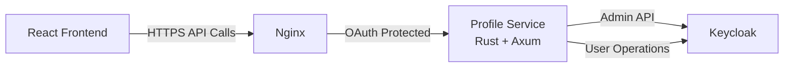

# Profile Service Documentation

## Overview

The Profile Service is a Rust-based backend API that provides user profile management functionality, acting as an intermediary between the React frontend and Keycloak. This service abstracts Keycloak implementation details from the frontend, providing a clean REST API.

## Architecture



## Technology Stack

- **Language**: Rust
- **Web Framework**: Axum 0.7
- **HTTP Client**: Reqwest
- **API Documentation**: utoipa + Swagger UI
- **Container**: Alpine Linux (minimal footprint)

## Features

### 1. User Profile Management
- Get current user profile
- Update profile (firstName, lastName, email)
- Change password with current password verification

### 2. API Documentation
- OpenAPI 3.0 specification
- Interactive Swagger UI at `/swagger-ui`
- Complete request/response schemas

### 3. Security
- HTTPS-only endpoints
- OAuth2 authentication required
- User identification via headers (set by OAuth2-proxy)
- Keycloak admin credentials never exposed to frontend

### 4. Performance
- Rust provides excellent performance
- Small binary size (~10-15MB)
- Low memory footprint
- Fast startup time

## API Endpoints

### GET `/api/profile`
Get current user's profile information.

**Authentication**: Required (OAuth2)

**Response**:
```json
{
  "id": "user-uuid",
  "username": "testuser",
  "email": "test@lianel.se",
  "firstName": "Test",
  "lastName": "User",
  "name": "Test User",
  "email_verified": true,
  "enabled": true
}
```

### PUT `/api/profile`
Update user profile information.

**Authentication**: Required (OAuth2)

**Request Body**:
```json
{
  "firstName": "New First Name",
  "lastName": "New Last Name",
  "email": "newemail@lianel.se"
}
```

**Response**: Updated user profile (same format as GET)

### POST `/api/profile/change-password`
Change user password.

**Authentication**: Required (OAuth2)

**Request Body**:
```json
{
  "current_password": "oldpassword",
  "new_password": "newpassword123"
}
```

**Response**:
```json
{
  "message": "Password changed successfully"
}
```

### GET `/health`
Health check endpoint.

**Response**:
```json
{
  "status": "ok",
  "service": "lianel-profile-service"
}
```

### GET `/swagger-ui`
Interactive API documentation (Swagger UI).

**Authentication**: Required (OAuth2)

### GET `/api-doc/openapi.json`
OpenAPI 3.0 specification JSON.

**Authentication**: Required (OAuth2)

## Configuration

### Environment Variables

Required in `.env` file:
```bash
KEYCLOAK_ADMIN_USER=admin
KEYCLOAK_ADMIN_PASSWORD=your-password
KEYCLOAK_REALM=lianel  # Optional, defaults to 'lianel'
KEYCLOAK_URL=http://keycloak:8080  # Optional
PORT=3000  # Optional, defaults to 3000
RUST_LOG=info  # Optional, logging level
```

### Docker Compose

```yaml
services:
  profile-service:
    image: lianel-profile-service:latest
    container_name: lianel-profile-service
    env_file:
      - .env
    environment:
      PORT: 3000
      KEYCLOAK_URL: http://keycloak:8080
      KEYCLOAK_REALM: ${KEYCLOAK_REALM:-lianel}
      KEYCLOAK_ADMIN_USER: ${KEYCLOAK_ADMIN_USER}
      KEYCLOAK_ADMIN_PASSWORD: ${KEYCLOAK_ADMIN_PASSWORD}
      RUST_LOG: info
    expose:
      - "3000"
    depends_on:
      - keycloak
    restart: unless-stopped
    networks:
      - lianel-network
```

## Deployment

### CI/CD Pipeline

Automated deployment via GitHub Actions:
- Triggers on changes to `lianel/dc/profile-service/**`
- Builds Rust service for `linux/amd64`
- Pushes to GHCR
- Deploys to remote host
- Verifies health endpoint

### Manual Deployment

```bash
# Build image
cd lianel/dc/profile-service
docker buildx build --platform linux/amd64 -t lianel-profile-service:latest -f Dockerfile .

# Deploy
docker-compose -f docker-compose.backend.yaml up -d profile-service
```

## Frontend Integration

The React frontend uses the Profile Service for all profile operations:

### Profile Page (`/profile`)
- Displays user information
- Edit mode for updating profile
- Change password form
- Error and success messaging

### User Dropdown
- Fetches user info from `/api/profile`
- Displays user name and email
- Links to profile page

## Security Architecture

1. **Authentication**: All endpoints require OAuth2 authentication via nginx
2. **User Identification**: User info extracted from headers set by OAuth2-proxy
3. **Keycloak Access**: Service uses admin credentials to access Keycloak Admin API
4. **Password Verification**: Current password verified before allowing change
5. **HTTPS Enforcement**: All API endpoints enforce HTTPS

## Error Handling

The service provides structured error responses:

```json
{
  "error": "Error message",
  "details": "Detailed error information"
}
```

Common HTTP status codes:
- `200`: Success
- `400`: Bad request (validation errors)
- `401`: Unauthorized (authentication required)
- `404`: Not found (user not found)
- `500`: Internal server error

## Monitoring

### Health Checks
- Health endpoint at `/health`
- Used by deployment pipeline for verification
- Returns service status

### Logging
- Structured logging via `tracing`
- Log level controlled by `RUST_LOG` environment variable
- Logs accessible via `docker logs lianel-profile-service`

## Performance Characteristics

- **Startup Time**: < 1 second
- **Memory Usage**: ~15-20MB
- **Binary Size**: ~10-15MB
- **Response Time**: < 100ms for most operations
- **Concurrent Requests**: Handles thousands of concurrent connections

## Troubleshooting

### Service Not Starting
- Check environment variables are set correctly
- Verify Keycloak is accessible
- Check logs: `docker logs lianel-profile-service`

### API Errors
- Verify OAuth2 authentication is working
- Check user exists in Keycloak
- Verify admin credentials are correct

### Build Issues
- Ensure Rust version is compatible (1.83+)
- Check Cargo.toml dependencies
- Verify Docker buildx is configured for linux/amd64

## Future Enhancements

Potential future features:
- Email verification resend
- Profile picture upload
- Two-factor authentication settings
- Account deletion
- Activity history
- Notification preferences
- Rate limiting per user
- Audit logging

## Related Documentation

- [Backend Profile Service Implementation](../dc/BACKEND-PROFILE-SERVICE.md)
- [Profile Service Deployment Guide](../dc/profile-service/DEPLOYMENT.md)
- [Security Configuration](./P0-06-SECURITY-CONFIGURATION.md)

