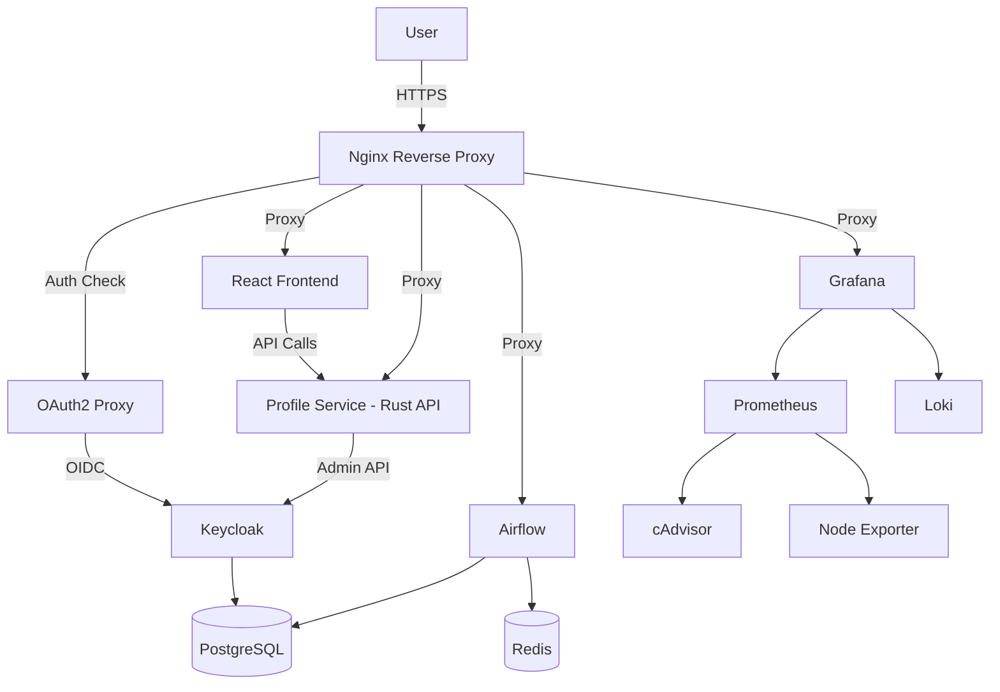
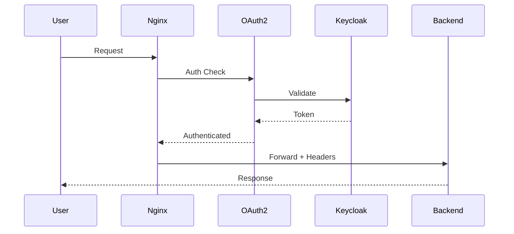

# Lianel Infrastructure Documentation

Complete technical documentation for the Lianel containerized web application platform.

## Documentation Index

### 1. [System Overview](./P0-01-SYSTEM-OVERVIEW.md)
**Purpose**: High-level architecture and system design

**Contents**:
- Executive summary
- System architecture diagrams
- Domain structure
- Technology stack
- Network architecture
- Security architecture
- Service dependencies
- Data flow diagrams
- File structure
- Operational characteristics

**Audience**: All stakeholders, new team members, architects

---

### 2. [Technical Specifications](./P0-02-TECHNICAL-SPECIFICATIONS.md)
**Purpose**: Detailed technical specifications for all components

**Contents**:
- Server infrastructure specs
- Service specifications (Nginx, Keycloak, OAuth2 Proxy, Airflow, Grafana, etc.)
- Network configuration
- Storage configuration
- Environment variables
- Performance characteristics
- Resource usage metrics
- Monitoring metrics
- Backup and recovery strategy
- Security specifications

**Audience**: DevOps engineers, system administrators, developers

---

### 3. [Architecture Documentation](./P0-03-ARCHITECTURE.md)
**Purpose**: Deep dive into architectural patterns and design decisions

**Contents**:
- System architecture layers
- Component interactions
- Design patterns (Reverse Proxy, Sidecar, Gateway, etc.)
- Scalability considerations
- Security architecture
- Failure modes and recovery
- Performance optimization
- Technology decisions and rationale

**Audience**: Architects, senior developers, technical leads

---

### 4. [Deployment Guide](./P0-04-DEPLOYMENT-GUIDE.md)
**Purpose**: Step-by-step deployment and maintenance procedures

**Contents**:
- Prerequisites
- Initial server setup
- Application deployment steps
- Post-deployment configuration
- Verification procedures
- Troubleshooting guide
- Maintenance procedures
- Rollback procedures
- Disaster recovery
- CI/CD automation examples

**Audience**: DevOps engineers, system administrators

---

### 5. [Monitoring Setup](./P0-05-MONITORING-SETUP.md)
**Purpose**: Complete monitoring stack configuration and usage

**Contents**:
- Monitoring architecture
- Component configuration (Prometheus, Grafana, Loki, cAdvisor, etc.)
- Dashboard configuration
- Container ID mapping
- Key queries and metrics
- Alerting setup (future)
- Troubleshooting monitoring issues
- Maintenance procedures
- Performance tuning
- Best practices

**Audience**: DevOps engineers, SREs, system administrators

---

### 6. [Security Configuration](./P0-06-SECURITY-CONFIGURATION.md)
**Purpose**: Comprehensive security setup and best practices

**Contents**:
- Security layers overview
- Network security (firewall, SSL/TLS)
- Authentication and authorization (SSO, OAuth2, Keycloak)
- Application security (rate limiting, headers)
- Container security
- Data security (secrets, encryption)
- Logging and auditing
- Compliance checklist
- Incident response procedures
- Security hardening recommendations
- Security testing procedures

**Audience**: Security engineers, DevOps engineers, compliance officers

---

### 7. [Remote Host Analysis](./P0-07-REMOTE-HOST-ANALYSIS.md)

### 8. [Profile Service](./P0-08-PROFILE-SERVICE.md)
**Purpose**: Profile Service API documentation and architecture

**Contents**:
- Profile Service overview
- API endpoints and schemas
- Security architecture
- Deployment procedures
- Frontend integration
- Troubleshooting guide

**Audience**: Backend developers, API consumers, DevOps engineers

---
**Purpose**: Current state analysis of production remote host

**Contents**:
- System specifications and resource usage
- Running containers status
- Environment variables inventory
- Database status
- SSL certificates configuration
- Docker images and deployment archives
- Identified issues and recommendations
- Deployment workflow documentation
- Security notes and resource monitoring

**Audience**: DevOps engineers, system administrators, developers

---

## Quick Start

### For New Team Members
1. Start with [System Overview](./P0-01-SYSTEM-OVERVIEW.md) to understand the big picture
2. Review [Architecture Documentation](./P0-03-ARCHITECTURE.md) to understand design decisions
3. Read [Technical Specifications](./P0-02-TECHNICAL-SPECIFICATIONS.md) for component details

### For Deployment
1. Follow [Deployment Guide](./P0-04-DEPLOYMENT-GUIDE.md) step-by-step
2. Configure monitoring using [Monitoring Setup](./P0-05-MONITORING-SETUP.md)
3. Review [Security Configuration](./P0-06-SECURITY-CONFIGURATION.md) for hardening

### For Operations
1. Reference [Monitoring Setup](./P0-05-MONITORING-SETUP.md) for day-to-day monitoring
2. Use [Deployment Guide](./P0-04-DEPLOYMENT-GUIDE.md) for maintenance procedures
3. Keep [Security Configuration](./P0-06-SECURITY-CONFIGURATION.md) handy for security tasks

### For Troubleshooting
1. Check [Monitoring Setup](./P0-05-MONITORING-SETUP.md) troubleshooting section
2. Review [Deployment Guide](./P0-04-DEPLOYMENT-GUIDE.md) troubleshooting section
3. Consult [Technical Specifications](./P0-02-TECHNICAL-SPECIFICATIONS.md) for component details

---

## System At A Glance

### Infrastructure
- **Platform**: Single VPS (72.60.80.84)
- **OS**: Ubuntu/Debian Linux
- **Orchestration**: Docker Compose
- **Domains**: lianel.se, www.lianel.se, auth.lianel.se, airflow.lianel.se, monitoring.lianel.se

### Key Services
- **Frontend**: React application with user profile management
- **Profile Service**: Rust-based backend API for user profile operations
- **Orchestration**: Apache Airflow 3.1.3
- **Authentication**: Keycloak + OAuth2 Proxy
- **Monitoring**: Prometheus + Grafana + Loki
- **Reverse Proxy**: Nginx with SSL/TLS
- **Databases**: PostgreSQL (host-level)

### Access Points
- **Main Site**: https://www.lianel.se
- **Profile Management**: https://www.lianel.se/profile
- **API Documentation**: https://www.lianel.se/swagger-ui/
- **Monitoring**: https://www.lianel.se/monitoring/
- **Airflow**: https://airflow.lianel.se
- **Keycloak**: https://auth.lianel.se

### Security
- **Authentication**: SSO via Keycloak (OIDC)
- **Encryption**: TLS 1.2/1.3 (Let's Encrypt)
- **Network**: Firewall (UFW), isolated Docker network
- **Secrets**: Environment variables, encrypted backups

---

## Architecture Diagrams

### High-Level Architecture


### Authentication Flow


---

## Common Tasks

### Deploy New Version
```bash
cd /root/lianel/dc
git pull
docker-compose -f docker-compose.frontend.yaml build
docker-compose -f docker-compose.frontend.yaml up -d
```

### Check System Health
```bash
docker ps
docker stats
curl -I https://www.lianel.se
```

### View Logs
```bash
docker logs nginx-proxy --tail 50
docker logs oauth2-proxy --tail 50
docker logs grafana --tail 50
```

### Backup Database
```bash
sudo -u postgres pg_dump airflow > /backup/airflow_$(date +%d-%m-%Y).sql
sudo -u postgres pg_dump keycloak > /backup/keycloak_$(date +%d-%m-%Y).sql
```

### Restart Service
```bash
docker-compose -f docker-compose.monitoring.yaml restart grafana
```

---

## Support and Maintenance

### Regular Maintenance Schedule
- **Daily**: Monitor dashboards, check logs
- **Weekly**: Review security logs, check disk space
- **Monthly**: Update Docker images, test backups
- **Quarterly**: Security audit, update documentation

### Getting Help
1. Check relevant documentation section
2. Review troubleshooting guides
3. Check container logs
4. Contact team lead or DevOps

### Contributing to Documentation
- Keep documentation up-to-date with changes
- Use Mermaid for diagrams
- Follow existing formatting
- Include examples and commands
- Test all procedures before documenting

---

## Version History

| Version | Date | Changes | Author |
|---------|------|---------|--------|
| 1.0 | 2024-12-01 | Initial documentation | System |
| 1.1 | 2024-12-04 | Added Remote Host Analysis | System |

---

## Additional Resources

### External Documentation
- [Docker Documentation](https://docs.docker.com/)
- [Nginx Documentation](https://nginx.org/en/docs/)
- [Keycloak Documentation](https://www.keycloak.org/documentation)
- [Apache Airflow Documentation](https://airflow.apache.org/docs/)
- [Grafana Documentation](https://grafana.com/docs/)
- [Prometheus Documentation](https://prometheus.io/docs/)

### Related Files
- Configuration files: `/root/lianel/dc/`
- Environment variables: `/root/lianel/dc/.env`
- Nginx config: `/root/lianel/dc/nginx/config/nginx.conf`
- Monitoring config: `/root/lianel/dc/monitoring/`

---

## Contact Information

**System Administrator**: [Your contact]  
**Security Team**: [Security contact]  
**Emergency**: [Emergency contact]

---

*Last Updated: December 4, 2024*
